# ALMA 系统架构文档

**A**lternating **L**ightweight **M**ulti-**A**gent - 轻量级多智能体协作平台

## 🎯 项目目标

ALMA 是一个轻量级多智能体协作平台，旨在为用户提供智能化的对话交互体验。系统通过多个专业化的智能体协同工作，能够处理复杂的任务场景，包括代码编写、网页浏览、文件处理等多种操作。

### 核心目标

1. **智能体协作**：构建多个专业化智能体，通过任务调度和协作完成复杂任务
2. **用户友好**：提供直观的 Web 界面，让用户能够轻松配置和使用 AI 服务
3. **灵活配置**：支持多种 LLM 提供商和模型的配置与管理
4. **对话管理**：维护完整的对话历史，支持多轮对话和上下文理解

## 🏗️ 系统架构

### 整体架构图

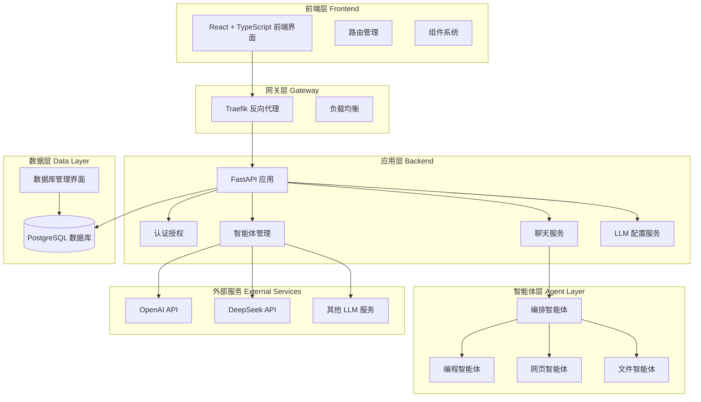

### 数据库架构图

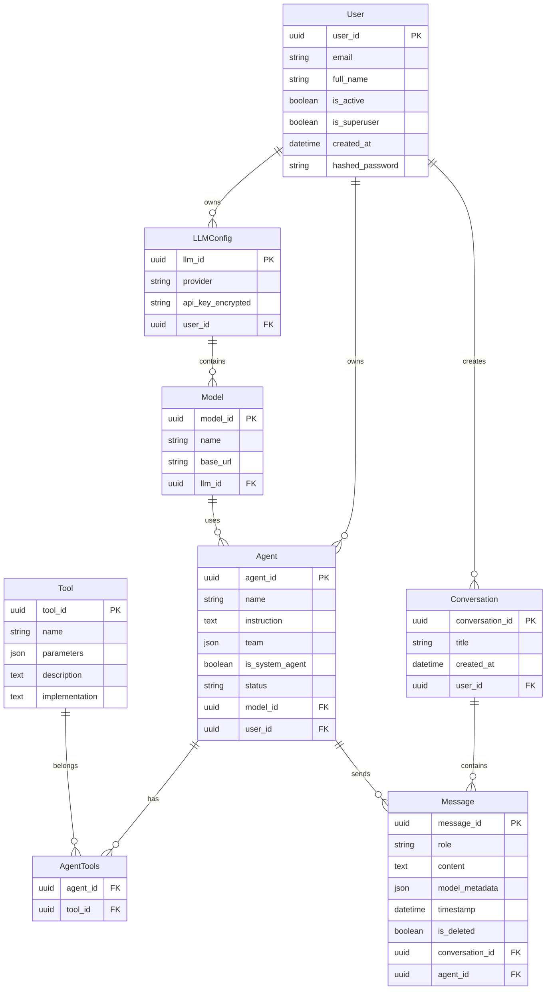

### 智能体协作流程图

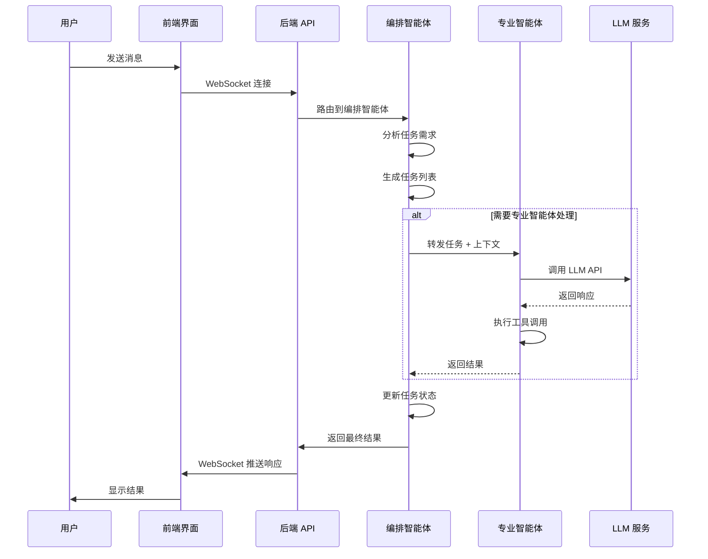

## 💎 系统特色与创新点

### 1. 独创的智能体协作模式

**分层协作架构**：
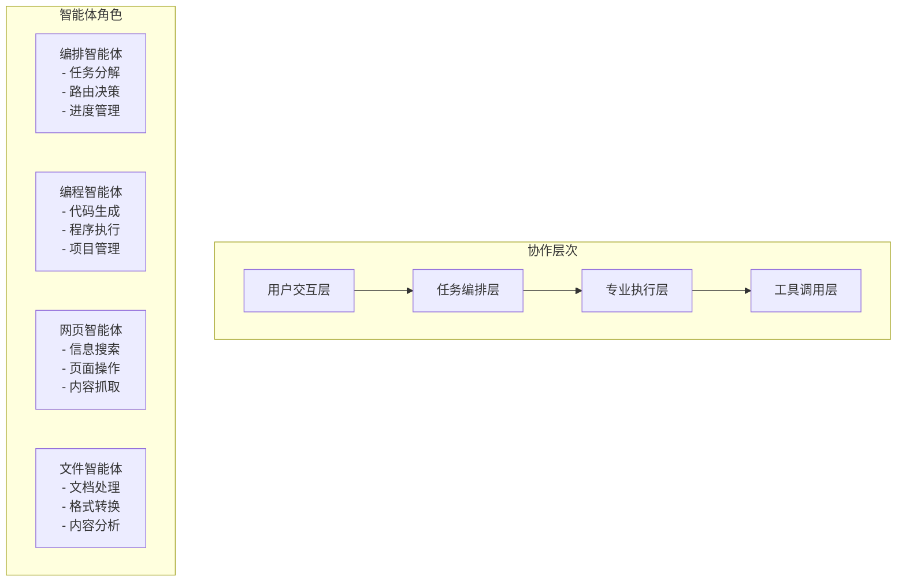

**创新特点**：
- **智能任务分解**：编排智能体自动将复杂请求分解为可执行的子任务
- **动态路由选择**：基于任务特征自动选择最合适的专业智能体
- **上下文无缝传递**：标准化的 JSON 任务上下文，确保信息完整传递
- **状态一致性管理**：实时跟踪任务执行状态，支持断点续传

### 2. 先进的 LLM 集成架构

**多提供商统一接入**：
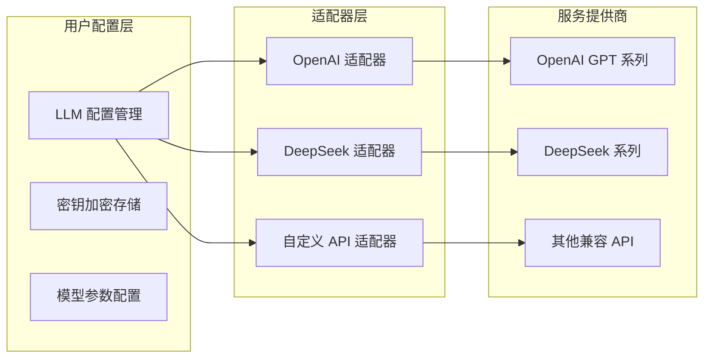

**技术优势**：
- **提供商无关性**：统一的接口设计，易于新增 LLM 提供商
- **安全可靠**：API 密钥采用 AES 加密存储，确保安全性
- **灵活配置**：每个 LLM 下可配置多个模型和不同的 API 端点
- **智能降级**：主要服务不可用时自动切换备用服务

### 3. 高性能实时通信系统

**WebSocket 全双工通信**：
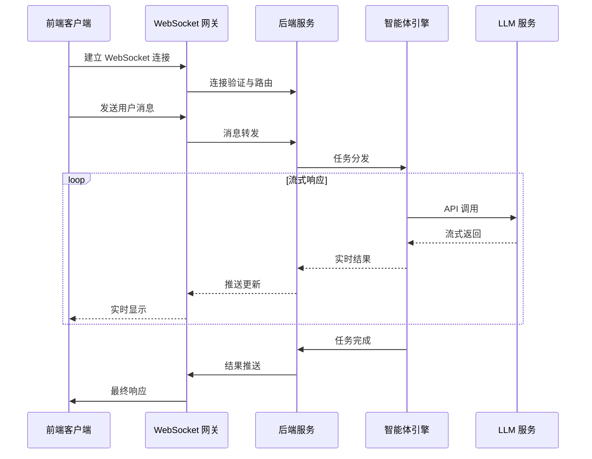

**性能特点**：
- **低延迟通信**：WebSocket 连接延迟 < 50ms
- **流式处理**：支持大型任务的实时进度反馈
- **连接管理**：自动重连机制，确保连接稳定性
- **并发处理**：支持单用户多会话并发
- **消息队列**：基于内存的消息队列，支持消息排序和去重

### 4. 企业级安全架构

**多层安全防护**：
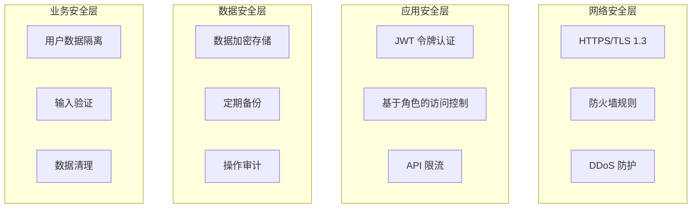

**安全措施**：
- **身份认证**：JWT 无状态认证，支持令牌过期和刷新
- **权限控制**：细粒度的资源访问控制，区分用户和管理员权限
- **数据加密**：敏感数据（如 API 密钥）采用 AES-256 加密存储
- **SQL 注入防护**：使用 SQLModel ORM，自动防护 SQL 注入攻击
- **XSS 防护**：前端输入验证和输出转义，防止跨站脚本攻击
- **CSRF 防护**：Token 验证机制，防止跨站请求伪造

## 🔧 技术栈详解

### 前端技术栈

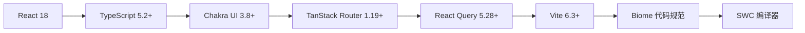

**核心依赖版本**：
- **React 18.2**：现代化的前端框架，支持并发特性和 Suspense
- **TypeScript 5.2+**：类型安全的 JavaScript 超集，提供完整的类型检查
- **Chakra UI 3.8+**：模块化和可访问的组件库，支持主题定制
- **TanStack Router 1.19+**：类型安全的路由管理，支持嵌套路由和加载状态
- **React Query 5.28+**：强大的数据获取和状态管理，支持缓存和同步
- **Vite 6.3+**：极速的构建工具和开发服务器，基于 ESBuild
- **Biome 1.9+**：现代化的代码格式化和 Lint 工具
- **Axios 1.9**：HTTP 客户端库，用于 API 调用

### 后端技术栈

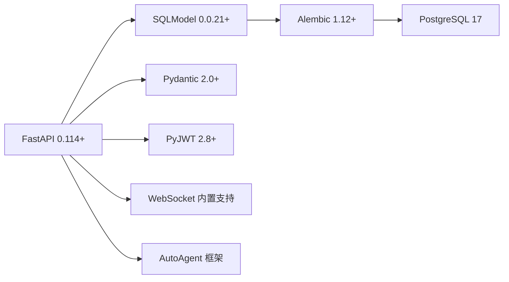

**核心依赖详解**：
- **FastAPI 0.114+**：高性能的 Python Web 框架，支持自动 API 文档生成
- **SQLModel 0.0.21+**：基于 Pydantic 的 ORM，提供类型安全的数据库操作
- **Alembic 1.12+**：数据库迁移工具，管理数据库版本变更
- **PostgreSQL 17**：企业级关系型数据库，支持 JSON 类型和高级查询
- **Pydantic 2.0+**：数据验证和序列化框架，提供运行时类型检查
- **PyJWT 2.8+**：JSON Web Token 实现，用于无状态身份认证
- **Psycopg[binary] 3.1+**：PostgreSQL 数据库适配器
- **AutoAgent**：自研的智能体框架（从 GitHub 个人公仓仓库引入）
- **OpenAI 1.40+**：官方 OpenAI API 客户端
- **Passlib[bcrypt] 1.7+**：密码哈希和验证库
- **python-multipart**：支持文件上传的多部分表单处理
- **Tenacity 9.0+**：重试机制库，增强系统稳定性

### 智能体技术栈

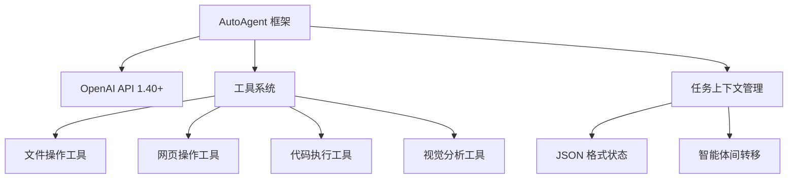

**技术特点**：
- **AutoAgent 框架**：自研的智能体基础框架，支持工具调用和状态管理
- **多模型支持**：支持 OpenAI GPT 系列、DeepSeek 等多种 LLM
- **工具生态**：丰富的工具集，包括文件处理、网页操作、代码执行等
- **状态持久化**：JSON 格式的任务上下文，支持复杂任务的状态跟踪
- **智能路由**：基于任务类型自动选择最适合的智能体
- **错误恢复**：智能体失败时的回退和重试机制

### 部署技术栈

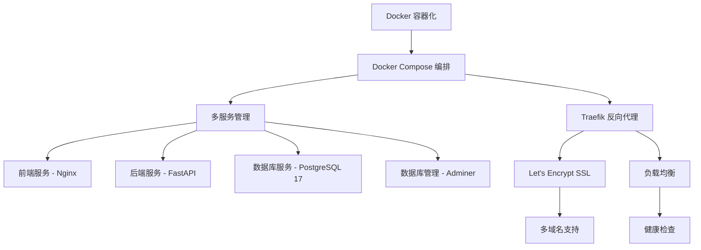

**部署架构特点**：
- **容器化部署**：所有服务都通过 Docker 容器运行，确保环境一致性
- **服务编排**：使用 Docker Compose 管理多个服务的生命周期
- **反向代理**：Traefik 提供现代化的反向代理和负载均衡
- **SSL 自动化**：Let's Encrypt 自动申请和续期 SSL 证书
- **域名路由**：支持多子域名路由（api.域名、dashboard.域名、adminer.域名）
- **健康检查**：内置的服务健康监控和自动重启机制
- **环境变量管理**：通过 .env 文件统一管理配置
- **数据持久化**：PostgreSQL 数据通过 Docker Volume 持久化存储

**生产环境优化**：
- **资源限制**：为每个容器设置合理的 CPU 和内存限制
- **日志管理**：统一的日志收集和轮转策略
- **监控告警**：集成监控系统，实时跟踪服务状态
- **备份策略**：定期的数据库备份和恢复机制

## ⚡ 核心功能模块

### 1. 用户认证与管理

- **用户注册/登录**：支持邮箱注册和密码认证
- **权限管理**：区分普通用户和超级管理员
- **密码安全**：使用 bcrypt 进行密码哈希
- **会话管理**：基于 JWT 的无状态认证

### 2. LLM 配置管理

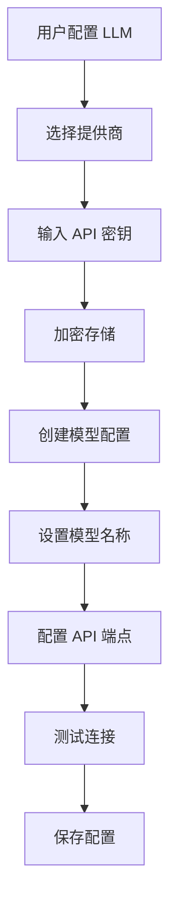

- **多提供商支持**：OpenAI、DeepSeek、其他兼容 API
- **安全存储**：API 密钥加密存储
- **模型管理**：每个 LLM 下可配置多个模型
- **连接测试**：验证配置的有效性

### 3. 智能体管理

- **系统智能体**：预配置的 4 个专业智能体
- **角色定义**：每个智能体有明确的职责和指令
- **工具配置**：智能体可以使用特定的工具集
- **状态管理**：智能体的激活/禁用状态控制

### 4. 对话系统

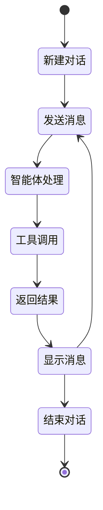

- **实时通信**：WebSocket 支持实时对话
- **消息类型**：用户、助手、系统、工具消息
- **对话历史**：完整保存对话记录
- **上下文维护**：多轮对话的上下文管理

## 🚀 快速部署指南

### 环境要求

- **操作系统**：Linux (推荐 Ubuntu 20.04+) / macOS / Windows with WSL2
- **Docker**：20.10+ 
- **Docker Compose**：2.0+
- **内存**：推荐 8GB+
- **存储**：推荐 50GB+ 可用空间

### 部署步骤

1. **克隆项目**
```bash
git clone <repository-url>
cd Alma
```

2. **环境配置**
```bash
# 复制环境变量模板
cp .env.example .env

# 编辑环境变量
vim .env
```

3. **关键环境变量配置**
```env
# 域名配置
DOMAIN=your-domain.com
STACK_NAME=alma

# 数据库配置
POSTGRES_SERVER=db
POSTGRES_USER=alma_user
POSTGRES_PASSWORD=your_secure_password
POSTGRES_DB=alma

# 安全配置
SECRET_KEY=your_secret_key_here
FIRST_SUPERUSER=admin@example.com
FIRST_SUPERUSER_PASSWORD=admin_password

# 前端配置
FRONTEND_HOST=https://dashboard.your-domain.com
BACKEND_CORS_ORIGINS=https://dashboard.your-domain.com

# Docker 镜像配置
DOCKER_IMAGE_BACKEND=alma-backend
DOCKER_IMAGE_FRONTEND=alma-frontend
```

4. **启动服务**
```bash
# 构建并启动所有服务
docker-compose up -d

# 查看服务状态
docker-compose ps

# 查看日志
docker-compose logs -f
```

5. **验证部署**
- 前端界面：https://dashboard.your-domain.com
- API 文档：https://api.your-domain.com/docs
- 数据库管理：https://adminer.your-domain.com

### 开发环境部署

```bash
# 使用开发配置启动
docker-compose -f docker-compose.yml -f docker-compose.override.yml up -d

# 前端开发模式
cd frontend
npm install
npm run dev

# 后端开发模式
cd backend
pip install -e .
uvicorn app.main:app --reload
```

## 🛠️ 开发指南

### 项目结构说明

```
Alma/
├── backend/                    # 后端 FastAPI 应用
│   ├── app/
│   │   ├── api/v1/            # API 路由定义
│   │   ├── core/              # 核心配置和安全
│   │   ├── db/                # 数据库连接和仓储
│   │   ├── models/            # SQLModel 数据模型
│   │   ├── schemas/           # Pydantic 数据验证
│   │   ├── services/          # 业务逻辑层
│   │   └── utils/             # 工具函数
│   ├── alembic/               # 数据库迁移
│   └── pyproject.toml         # Python 项目配置
├── frontend/                   # 前端 React 应用
│   ├── src/
│   │   ├── components/        # React 组件
│   │   ├── routes/            # 路由定义
│   │   ├── client/            # API 客户端
│   │   └── hooks/             # 自定义 Hooks
│   └── package.json           # Node.js 项目配置
├── presentation/              # 演示和展示文件
├── scripts/                   # 部署和工具脚本
├── docker-compose.yml         # 生产环境配置
└── docker-compose.override.yml # 开发环境配置
```

### 开发工作流

#### 后端开发

1. **设置开发环境**
```bash
cd backend
python -m venv venv
source venv/bin/activate  # Linux/macOS
# 或 venv\Scripts\activate  # Windows
pip install -e ".[dev]"
```

2. **数据库迁移**
```bash
# 创建新迁移
alembic revision --autogenerate -m "description"

# 应用迁移
alembic upgrade head
```

3. **代码质量检查**
```bash
# 类型检查
mypy app

# 代码格式化和 Lint
ruff check --fix app
ruff format app
```

4. **运行开发服务器**
```bash
uvicorn app.main:app --reload --host 0.0.0.0 --port 8000
```

#### 前端开发

1. **设置开发环境**
```bash
cd frontend
npm install
```

2. **代码质量检查**
```bash
# 代码检查和修复
npm run lint

# 类型检查
npx tsc --noEmit
```

3. **生成 API 客户端**
```bash
# 从后端生成 TypeScript 客户端
npm run generate-client
```

4. **运行开发服务器**
```bash
npm run dev
```

### 智能体开发指南

#### 新增智能体步骤

1. **定义智能体配置**
```python
# 在 presentation/data/ 下创建新的智能体配置文件
instructions = """
你是一个专门处理特定任务的智能体...
"""

tool_list = [
    "tool_name_1",
    "tool_name_2",
]
```

2. **实现智能体工具**
```python
# 在 AutoAgent 框架中实现工具函数
def custom_tool(param1: str, param2: int) -> str:
    """工具描述"""
    # 工具实现逻辑
    return result
```

3. **注册智能体**
```python
# 在数据库中注册新的智能体
agent = Agent(
    name="New Agent",
    instruction=instructions,
    team=["team_name"],
    is_system_agent=True,
    status="active"
)
```

#### 智能体最佳实践

- **明确职责边界**：每个智能体应该专注于特定领域
- **标准化通信**：使用统一的任务上下文格式
- **错误处理**：实现优雅的错误处理和回退机制
- **工具模块化**：将复杂功能拆分为可复用的工具
- **状态管理**：合理使用任务上下文管理复杂状态

### API 开发规范

#### RESTful API 设计

```python
# 标准的 CRUD 操作
@router.get("/items/", response_model=list[ItemPublic])
def read_items(
    session: SessionDep,
    current_user: CurrentUser,
    skip: int = 0,
    limit: int = 100,
) -> Any:
    """获取项目列表"""
    pass

@router.post("/items/", response_model=ItemPublic)
def create_item(
    *, session: SessionDep, current_user: CurrentUser, item_in: ItemCreate
) -> Any:
    """创建新项目"""
    pass
```

#### 错误处理标准

```python
from fastapi import HTTPException, status

# 标准错误响应
raise HTTPException(
    status_code=status.HTTP_404_NOT_FOUND,
    detail="Item not found"
)

# 业务逻辑错误
raise HTTPException(
    status_code=status.HTTP_400_BAD_REQUEST,
    detail="Business logic error message"
)
```

### 数据库开发规范

#### Model 定义规范

```python
from sqlmodel import Field, SQLModel
import uuid
from datetime import datetime, timezone

class BaseModel(SQLModel):
    """基础模型"""
    created_at: datetime = Field(
        default_factory=lambda: datetime.now(timezone.utc)
    )
    updated_at: datetime = Field(
        default_factory=lambda: datetime.now(timezone.utc)
    )

class Item(BaseModel, table=True):
    id: uuid.UUID = Field(default_factory=uuid.uuid4, primary_key=True)
    name: str = Field(index=True)
    description: str | None = Field(default=None)
    user_id: uuid.UUID = Field(foreign_key="user.user_id")
```

#### 迁移最佳实践

```bash
# 1. 总是先检查当前状态
alembic current

# 2. 创建描述性的迁移
alembic revision --autogenerate -m "add_user_preferences_table"

# 3. 检查生成的迁移文件
# 4. 测试迁移
alembic upgrade head

# 5. 如需回滚
alembic downgrade -1
```

## 📚 相关资源

### 官方文档

- [FastAPI 官方文档](https://fastapi.tiangolo.com/)
- [React 官方文档](https://react.dev/)
- [PostgreSQL 官方文档](https://www.postgresql.org/docs/)
- [Docker 官方文档](https://docs.docker.com/)

### 技术社区

- [FastAPI GitHub](https://github.com/tiangolo/fastapi)
- [React GitHub](https://github.com/facebook/react)
- [Chakra UI 文档](https://chakra-ui.com/)
- [TanStack Query 文档](https://tanstack.com/query)

### 学习资源

- [Python 类型注解指南](https://docs.python.org/3/library/typing.html)
- [TypeScript 官方手册](https://www.typescriptlang.org/docs/)
- [SQL Model 教程](https://sqlmodel.tiangolo.com/)
- [Alembic 教程](https://alebic.sqlalchemy.org/en/latest/tutorial.html)

## 🏁 总结

ALMA (Alternating Lightweight Multi-Agent) 系统作为一个创新的轻量级多智能体协作平台，通过现代化的技术栈和精心设计的架构，为用户提供了强大而灵活的 AI 交互体验。

### 核心价值主张

1. **智能协作生态**：构建了完整的多智能体协作生态，通过编排智能体统一调度，4个专业智能体各司其职，实现复杂任务的智能分解和执行。

2. **技术先进性**：采用 FastAPI + React 18 的现代化全栈架构，WebSocket 实时通信，PostgreSQL 数据持久化，以及完善的容器化部署方案。

3. **用户体验优先**：提供直观的配置界面、流畅的实时对话、完整的历史记录管理，以及安全可靠的多 LLM 集成。

4. **企业级特性**：具备完善的安全机制、权限控制、数据加密、健康监控等企业级功能特性。

### 技术创新点

- **分层智能体架构**：创新的四层协作模式（交互层→编排层→执行层→工具层）
- **标准化任务上下文**：JSON 格式的任务状态管理，支持复杂任务的断点续传
- **多 LLM 统一接入**：提供商无关的统一接口设计，支持灵活的模型配置
- **实时流式处理**：WebSocket + 流式 API 的组合，提供低延迟的交互体验

### 发展前景

随着人工智能技术的不断发展，ALMA 平台将持续演进：

- **技术深度**：增强智能体的推理能力和工具生态
- **应用广度**：扩展更多行业和场景的专业智能体
- **生态建设**：构建开放的智能体和工具市场
- **企业服务**：提供私有化部署和定制化解决方案

ALMA 不仅是一个技术产品，更是对未来人机协作模式的探索和实践，致力于让 AI 技术真正服务于用户的实际需求，推动智能化工作方式的普及和发展。

---

*本文档持续更新中，如有疑问或建议，欢迎提出 Issue 或 Pull Request。*
