# ALMA 系统设计文档

**A**lternating **L**ightweight **M**ulti-**A**gent - 轻量级多智能体协作平台

---

## 📋 文档信息

| 项目信息 | 详情 |
|---------|------|
| **项目名称** | ALMA (Alternating Lightweight Multi-Agent) |
| **项目类型** | 轻量级多智能体协作平台 |
| **设计版本** | v1.0 |
| **创建日期** | 2025-06-24 |
| **更新日期** | 2025-06-24 |
| **相关文档** | [ALMA 需求文档](./ALMA-需求文档.md) |

---

## 📖 文档目录

### 🏗️ [第1章 系统架构设计](#1-系统架构设计)
- 1.1 [总体架构](#11-总体架构)
- 1.2 [技术架构](#12-技术架构)
- 1.3 [部署架构](#13-部署架构)
- 1.4 [数据架构](#14-数据架构)
- 1.5 [安全架构](#15-安全架构)

### 🗄️ [第2章 数据库设计](#2-数据库设计)
- 2.1 [数据模型概述](#21-数据模型概述)
- 2.2 [核心实体设计](#22-核心实体设计)
- 2.3 [数据表结构](#23-数据表结构)
- 2.4 [索引策略](#24-索引策略)
- 2.5 [数据迁移方案](#25-数据迁移方案)

### 🔗 [第3章 API 接口设计](#3-api-接口设计)
- 3.1 [API 设计原则](#31-api-设计原则)
- 3.2 [认证授权接口](#32-认证授权接口)
- 3.3 [用户管理接口](#33-用户管理接口)
- 3.4 [LLM 配置接口](#34-llm-配置接口)
- 3.5 [智能体管理接口](#35-智能体管理接口)
- 3.6 [对话交互接口](#36-对话交互接口)
- 3.7 [WebSocket 通信协议](#37-websocket-通信协议)

### 🤖 [第4章 智能体系统设计](#4-智能体系统设计)
- 4.1 [智能体架构](#41-智能体架构)
- 4.2 [编排智能体设计](#42-编排智能体设计)
- 4.3 [专业智能体设计](#43-专业智能体设计)
- 4.4 [工具系统设计](#44-工具系统设计)
- 4.5 [任务调度机制](#45-任务调度机制)
- 4.6 [上下文管理](#46-上下文管理)

### 💬 [第5章 对话系统设计](#5-对话系统设计)
- 5.1 [对话流程设计](#51-对话流程设计)
- 5.2 [消息路由机制](#52-消息路由机制)
- 5.3 [实时通信设计](#53-实时通信设计)
- 5.4 [会话管理](#54-会话管理)
- 5.5 [历史记录管理](#55-历史记录管理)

### 🎨 [第6章 前端界面设计](#6-前端界面设计)
- 6.1 [UI/UX 设计原则](#61-uiux-设计原则)
- 6.2 [组件架构](#62-组件架构)
- 6.3 [状态管理](#63-状态管理)
- 6.4 [路由设计](#64-路由设计)
- 6.5 [响应式设计](#65-响应式设计)
- 6.6 [主题系统](#66-主题系统)

### 🔧 [第7章 后端服务设计](#7-后端服务设计)
- 7.1 [服务架构](#71-服务架构)
- 7.2 [业务逻辑层](#72-业务逻辑层)
- 7.3 [数据访问层](#73-数据访问层)
- 7.4 [外部服务集成](#74-外部服务集成)
- 7.5 [异步任务处理](#75-异步任务处理)
- 7.6 [错误处理机制](#76-错误处理机制)

### 🔐 [第8章 安全设计](#8-安全设计)
- 8.1 [认证系统](#81-认证系统)
- 8.2 [授权机制](#82-授权机制)
- 8.3 [数据加密](#83-数据加密)
- 8.4 [API 安全](#84-api-安全)
- 8.5 [防护措施](#85-防护措施)
- 8.6 [安全审计](#86-安全审计)

### ⚡ [第9章 性能优化设计](#9-性能优化设计)
- 9.1 [性能目标](#91-性能目标)
- 9.2 [缓存策略](#92-缓存策略)
- 9.3 [数据库优化](#93-数据库优化)
- 9.4 [前端性能优化](#94-前端性能优化)
- 9.5 [负载均衡](#95-负载均衡)
- 9.6 [监控指标](#96-监控指标)

### 🚀 [第10章 部署运维设计](#10-部署运维设计)
- 10.1 [容器化设计](#101-容器化设计)
- 10.2 [部署策略](#102-部署策略)
- 10.3 [环境配置](#103-环境配置)
- 10.4 [监控告警](#104-监控告警)
- 10.5 [日志管理](#105-日志管理)
- 10.6 [备份恢复](#106-备份恢复)

### 🧪 [第11章 测试设计](#11-测试设计)
- 11.1 [测试策略](#111-测试策略)
- 11.2 [单元测试设计](#112-单元测试设计)
- 11.3 [集成测试设计](#113-集成测试设计)
- 11.4 [E2E 测试设计](#114-e2e-测试设计)
- 11.5 [性能测试设计](#115-性能测试设计)
- 11.6 [测试自动化](#116-测试自动化)

### 📈 [第12章 扩展性设计](#12-扩展性设计)
- 12.1 [水平扩展设计](#121-水平扩展设计)
- 12.2 [垂直扩展设计](#122-垂直扩展设计)
- 12.3 [功能扩展机制](#123-功能扩展机制)
- 12.4 [插件系统设计](#124-插件系统设计)
- 12.5 [第三方集成](#125-第三方集成)

---

## 🎯 设计概述

本设计文档基于 [ALMA 需求文档](./ALMA-需求文档.md) 中定义的功能需求和非功能性需求，详细描述了 ALMA 轻量级多智能体协作平台的技术实现方案。

### 设计目标

- **架构清晰**：模块化设计，职责分离，易于理解和维护
- **技术先进**：采用现代技术栈，保证系统的先进性和生命力
- **性能优异**：满足需求文档中定义的性能指标
- **安全可靠**：多层次安全防护，确保数据安全和系统稳定
- **易于扩展**：支持水平和垂直扩展，适应业务增长需求

### 设计原则

1. **简洁性原则**：保持设计简洁，避免过度设计
2. **模块化原则**：高内聚低耦合的模块设计
3. **可测试性原则**：便于编写和执行各种测试
4. **可维护性原则**：代码清晰，文档完整，便于维护
5. **可扩展性原则**：预留扩展接口，支持功能增强

---

## 📝 章节状态

| 章节 | 状态 | 完成度 | 预计完成时间 |
|------|------|--------|-------------|
| 第1章 系统架构设计 | ✅ 已完成 | 100% | 2025-06-24 |
| 第2章 数据库设计 | ✅ 已完成 | 100% | 2025-06-24 |
| 第3章 API 接口设计 | ✅ 已完成 | 100% | 2025-06-24 |
| 第4章 智能体系统设计 | ✅ 已完成 | 100% | 2025-06-24 |
| 第5章 对话系统设计 | ⏳ 待编写 | 0% | TBD |
| 第6章 前端界面设计 | ⏳ 待编写 | 0% | TBD |
| 第7章 后端服务设计 | ⏳ 待编写 | 0% | TBD |
| 第8章 安全设计 | ⏳ 待编写 | 0% | TBD |
| 第9章 性能优化设计 | ⏳ 待编写 | 0% | TBD |
| 第10章 部署运维设计 | ⏳ 待编写 | 0% | TBD |
| 第11章 测试设计 | ⏳ 待编写 | 0% | TBD |
| 第12章 扩展性设计 | ⏳ 待编写 | 0% | TBD |

---

## 🚀 后续计划

1. **第一阶段**：完成核心章节（第1-4章）的详细设计
2. **第二阶段**：完成应用层章节（第5-7章）的详细设计
3. **第三阶段**：完成质量保证章节（第8-11章）的详细设计
4. **第四阶段**：完成扩展性设计（第12章）和文档完善

每个章节将包含：
- 详细的设计说明
- 架构图和流程图
- 关键代码示例
- 配置文件模板
- 最佳实践建议

---

*本设计文档将持续更新，确保与实际开发保持同步。如有疑问或建议，请及时沟通。*

---

# 1. 系统架构设计

本章节详细描述 ALMA 系统的整体架构设计，包括总体架构、技术架构、部署架构、数据架构和安全架构五个方面。

## 1.1 总体架构

### 1.1.1 架构概览

ALMA 采用分层架构和微服务架构相结合的设计模式，确保系统的可扩展性、可维护性和高可用性。

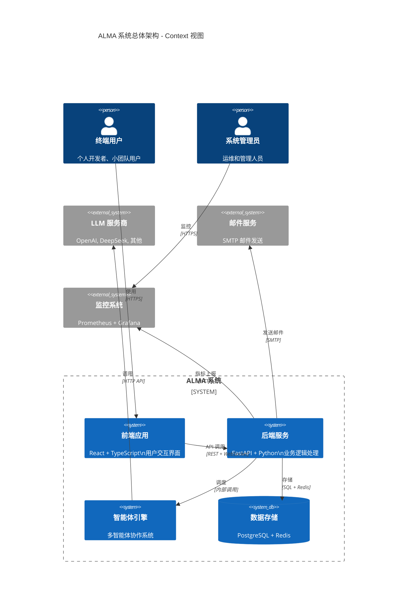
```mermaid
C4Context
    title ALMA 系统总体架构 - Context 视图
    
    Person(user, "终端用户", "个人开发者、小团队用户")
    Person(admin, "系统管理员", "运维和管理人员")
    
    System_Boundary(alma, "ALMA 系统") {
        System(frontend, "前端应用", "React + TypeScript\n用户交互界面")
        System(backend, "后端服务", "FastAPI + Python\n业务逻辑处理")
        System(agents, "智能体引擎", "多智能体协作系统")
        SystemDb(database, "数据存储", "PostgreSQL + Redis")
    }
    
    System_Ext(llm_providers, "LLM 服务商", "OpenAI, DeepSeek, 其他")
    System_Ext(email, "邮件服务", "SMTP 邮件发送")
    System_Ext(monitoring, "监控系统", "Prometheus + Grafana")
    
    Rel(user, frontend, "使用", "HTTPS")
    Rel(admin, monitoring, "监控", "HTTPS")
    Rel(frontend, backend, "API 调用", "REST + WebSocket")
    Rel(backend, agents, "调度", "内部调用")
    Rel(backend, database, "存储", "SQL + Redis")
    Rel(agents, llm_providers, "调用", "HTTP API")
    Rel(backend, email, "发送邮件", "SMTP")
    Rel(backend, monitoring, "指标上报", "HTTP")
```

### 1.1.2 架构分层

ALMA 系统采用经典的三层架构，每层职责清晰，便于开发和维护：

```mermaid
graph TB
    subgraph "表现层 (Presentation Layer)"
        A1[Web 前端界面]
        A2[移动端界面 (未来)]
        A3[API 文档界面]
    end
    
    subgraph "业务逻辑层 (Business Logic Layer)"
        B1[用户管理服务]
        B2[LLM 配置服务]
        B3[智能体管理服务]
        B4[对话交互服务]
        B5[任务调度服务]
    end
    
    subgraph "数据访问层 (Data Access Layer)"
        C1[ORM 数据访问]
        C2[缓存访问]
        C3[外部 API 调用]
        C4[文件存储访问]
    end
    
    subgraph "数据存储层 (Data Storage Layer)"
        D1[PostgreSQL 主数据库]
        D2[Redis 缓存]
        D3[对象存储]
        D4[日志存储]
    end
    
    A1 --> B1
    A1 --> B2
    A1 --> B3
    A1 --> B4
    
    B1 --> C1
    B2 --> C1
    B3 --> C1
    B4 --> C1
    B5 --> C2
    
    C1 --> D1
    C2 --> D2
    C3 --> D3
    C4 --> D4
```

### 1.1.3 核心组件关系

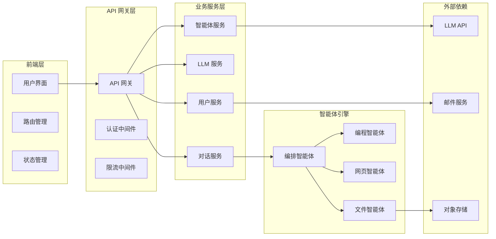
```mermaid
graph LR
    subgraph "前端层"
        UI[用户界面]
        Router[路由管理]
        Store[状态管理]
    end
    
    subgraph "API 网关层"
        Gateway[API 网关]
        Auth[认证中间件]
        RateLimit[限流中间件]
    end
    
    subgraph "业务服务层"
        UserSvc[用户服务]
        LLMSvc[LLM 服务]
        AgentSvc[智能体服务]
        ChatSvc[对话服务]
    end
    
    subgraph "智能体引擎"
        Orchestrator[编排智能体]
        CodingAgent[编程智能体]
        WebAgent[网页智能体]
        FileAgent[文件智能体]
    end
    
    subgraph "外部依赖"
        LLM[LLM API]
        Email[邮件服务]
        Storage[对象存储]
    end
    
    UI --> Gateway
    Gateway --> UserSvc
    Gateway --> LLMSvc
    Gateway --> AgentSvc
    Gateway --> ChatSvc
    
    ChatSvc --> Orchestrator
    Orchestrator --> CodingAgent
    Orchestrator --> WebAgent
    Orchestrator --> FileAgent
    
    AgentSvc --> LLM
    UserSvc --> Email
    FileAgent --> Storage
```

## 1.2 技术架构

### 1.2.1 技术栈选型

基于需求文档中的技术要求，ALMA 采用以下技术栈：

**前端技术栈**:
```yaml
核心框架:
  - React 18.2+: 用户界面构建
  - TypeScript 5.2+: 类型安全和开发体验
  - Vite 6.3+: 快速构建和热重载

UI 和交互:
  - Chakra UI 3.8+: 现代化组件库
  - Framer Motion: 动画和交互效果
  - React Hook Form: 表单处理

状态管理:
  - TanStack Query 5.28+: 服务端状态管理
  - Zustand: 客户端状态管理
  - TanStack Router: 类型安全路由

工具链:
  - Biome 1.9+: 代码格式化和 Lint
  - Vitest: 单元测试框架
  - Playwright: E2E 测试
```

**后端技术栈**:
```yaml
核心框架:
  - FastAPI 0.114+: 现代 Python Web 框架
  - SQLModel 0.0.21+: 类型安全的 ORM
  - Pydantic 2.0+: 数据验证和序列化

数据存储:
  - PostgreSQL 17: 主数据库
  - Redis 7.0+: 缓存和会话存储
  - MinIO: 对象存储 (可选)

异步处理:
  - asyncio: 异步编程支持
  - WebSocket: 实时通信
  - Celery: 后台任务处理 (可选)

工具链:
  - Alembic: 数据库迁移
  - pytest: 测试框架
  - Black + isort: 代码格式化
```

### 1.2.2 技术架构图

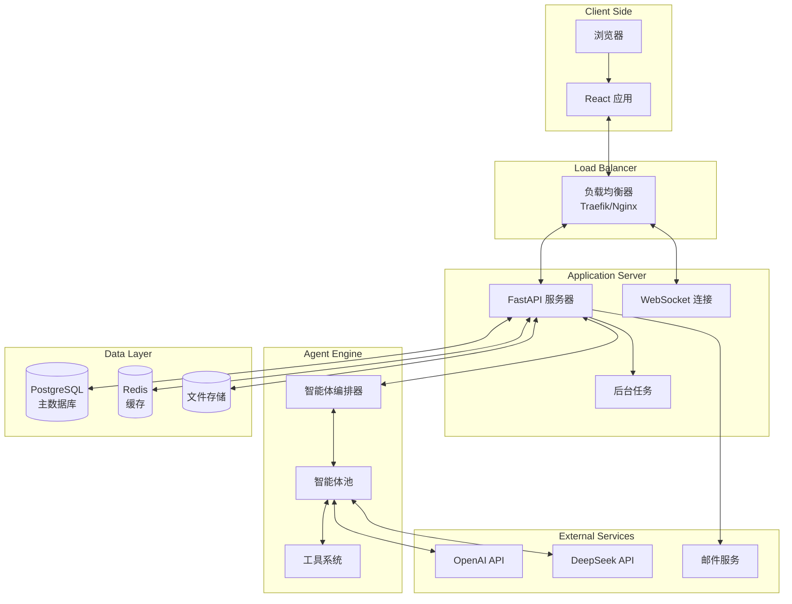
```mermaid
graph TB
    subgraph "Client Side"
        Browser[浏览器]
        ReactApp[React 应用]
        Browser --> ReactApp
    end
    
    subgraph "Load Balancer"
        LB[负载均衡器<br/>Traefik/Nginx]
    end
    
    subgraph "Application Server"
        FastAPI[FastAPI 服务器]
        WebSocket[WebSocket 连接]
        BackgroundTasks[后台任务]
    end
    
    subgraph "Agent Engine"
        AgentOrchestrator[智能体编排器]
        AgentPool[智能体池]
        ToolSystem[工具系统]
    end
    
    subgraph "Data Layer"
        PostgreSQL[(PostgreSQL<br/>主数据库)]
        Redis[(Redis<br/>缓存)]
        FileStorage[(文件存储)]
    end
    
    subgraph "External Services"
        OpenAI[OpenAI API]
        DeepSeek[DeepSeek API]
        SMTP[邮件服务]
    end
    
    ReactApp <--> LB
    LB <--> FastAPI
    LB <--> WebSocket
    FastAPI --> BackgroundTasks
    FastAPI <--> AgentOrchestrator
    AgentOrchestrator <--> AgentPool
    AgentPool <--> ToolSystem
    
    FastAPI <--> PostgreSQL
    FastAPI <--> Redis
    FastAPI <--> FileStorage
    
    AgentPool <--> OpenAI
    AgentPool <--> DeepSeek
    FastAPI --> SMTP
```

### 1.2.3 通信协议设计

**HTTP REST API**:
- 标准的 RESTful API 设计
- JSON 数据格式
- 统一的错误处理和响应格式

**WebSocket 实时通信**:
- 用户-智能体实时对话
- 任务执行状态实时推送
- 连接状态管理和断线重连

**内部服务通信**:
- 同步调用: 直接函数调用
- 异步任务: 消息队列 (可选 Celery + Redis)

## 1.3 部署架构

### 1.3.1 单机部署架构

适合小规模使用和快速体验：

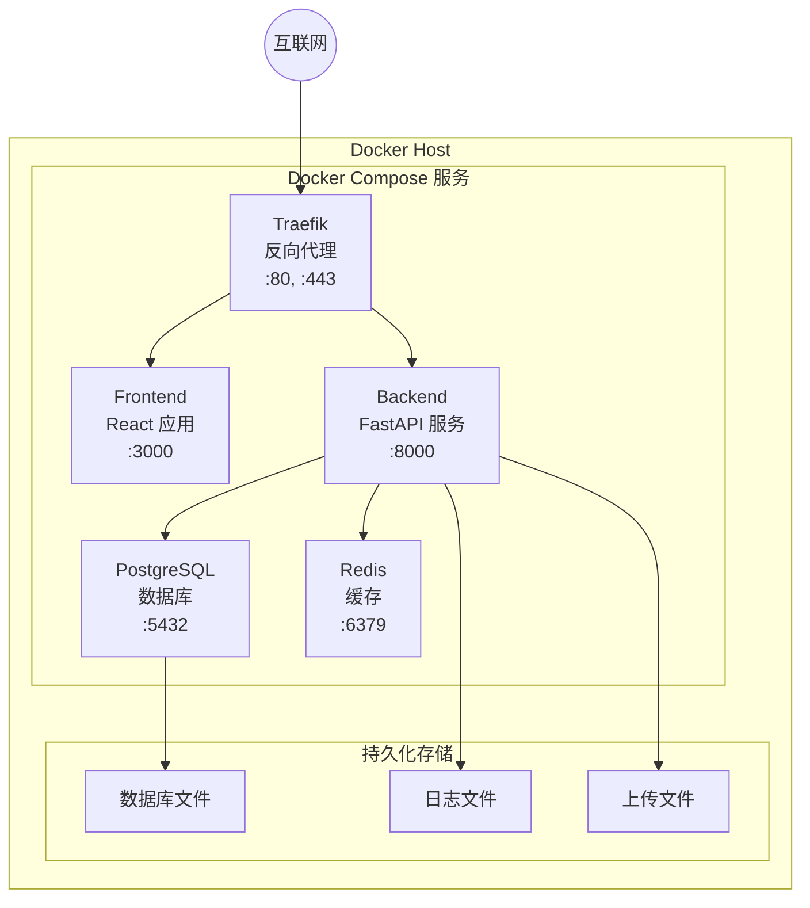
```mermaid
graph TB
    subgraph "Docker Host"
        subgraph "Docker Compose 服务"
            Traefik[Traefik<br/>反向代理<br/>:80, :443]
            Frontend[Frontend<br/>React 应用<br/>:3000]
            Backend[Backend<br/>FastAPI 服务<br/>:8000]
            DB[PostgreSQL<br/>数据库<br/>:5432]
            Cache[Redis<br/>缓存<br/>:6379]
        end
        
        subgraph "持久化存储"
            DBData[数据库文件]
            Logs[日志文件]
            Uploads[上传文件]
        end
    end
    
    Internet((互联网)) --> Traefik
    Traefik --> Frontend
    Traefik --> Backend
    Backend --> DB
    Backend --> Cache
    DB --> DBData
    Backend --> Logs
    Backend --> Uploads
```

**Docker Compose 配置结构**:
```yaml
# docker-compose.yml 核心结构
services:
  traefik:
    image: traefik:v3.0
    ports: ["80:80", "443:443"]
    
  frontend:
    build: ./frontend
    environment:
      - VITE_API_URL=https://api.alma.local
    
  backend:
    build: ./backend
    environment:
      - DATABASE_URL=postgresql://...
      - REDIS_URL=redis://cache:6379
    depends_on: [db, cache]
    
  db:
    image: postgres:17-alpine
    volumes: ["postgres_data:/var/lib/postgresql/data"]
    
  cache:
    image: redis:7-alpine
    volumes: ["redis_data:/data"]
```

### 1.3.2 集群部署架构

适合生产环境和高可用需求：

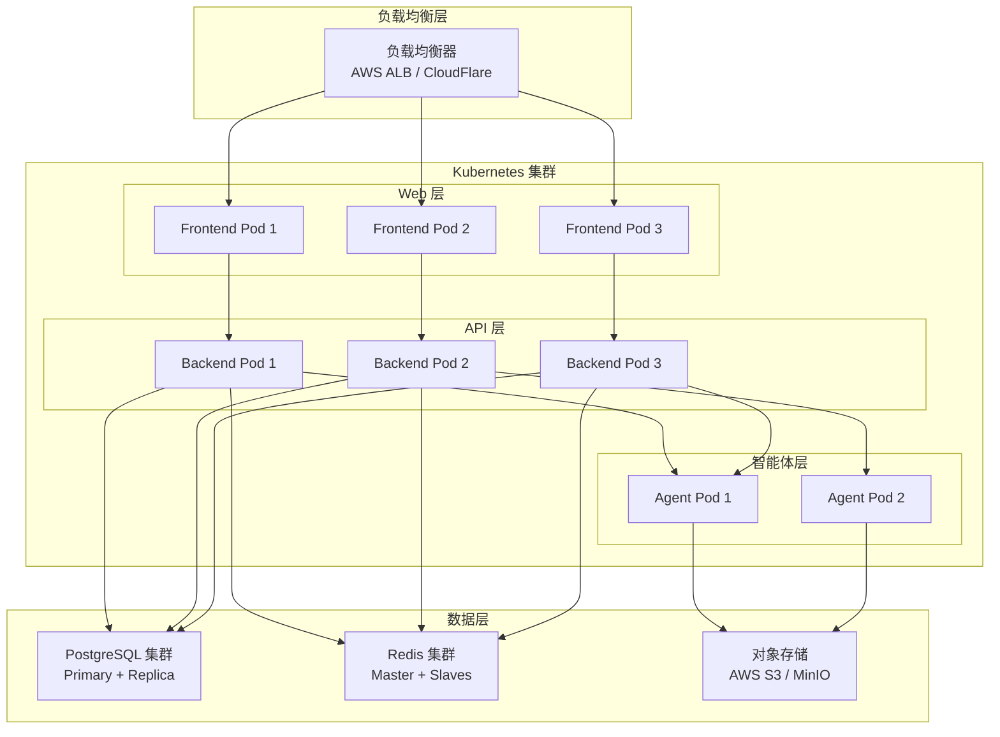
```mermaid
graph TB
    subgraph "负载均衡层"
        LB[负载均衡器<br/>AWS ALB / CloudFlare]
    end
    
    subgraph "Kubernetes 集群"
        subgraph "Web 层"
            Frontend1[Frontend Pod 1]
            Frontend2[Frontend Pod 2]
            Frontend3[Frontend Pod 3]
        end
        
        subgraph "API 层"
            Backend1[Backend Pod 1]
            Backend2[Backend Pod 2]
            Backend3[Backend Pod 3]
        end
        
        subgraph "智能体层"
            Agent1[Agent Pod 1]
            Agent2[Agent Pod 2]
        end
    end
    
    subgraph "数据层"
        DBCluster[PostgreSQL 集群<br/>Primary + Replica]
        RedisCluster[Redis 集群<br/>Master + Slaves]
        ObjectStorage[对象存储<br/>AWS S3 / MinIO]
    end
    
    LB --> Frontend1
    LB --> Frontend2
    LB --> Frontend3
    
    Frontend1 --> Backend1
    Frontend2 --> Backend2
    Frontend3 --> Backend3
    
    Backend1 --> Agent1
    Backend2 --> Agent2
    Backend3 --> Agent1
    
    Backend1 --> DBCluster
    Backend2 --> DBCluster
    Backend3 --> DBCluster
    
    Backend1 --> RedisCluster
    Backend2 --> RedisCluster
    Backend3 --> RedisCluster
    
    Agent1 --> ObjectStorage
    Agent2 --> ObjectStorage
```

### 1.3.3 环境配置

**开发环境**:
```yaml
目的: 开发和调试
特点:
  - 本地 Docker Compose
  - 热重载和调试支持
  - 模拟数据和测试 API Key
  - 详细的日志输出
```

**测试环境**:
```yaml
目的: 功能测试和集成测试
特点:
  - 接近生产的配置
  - 自动化测试执行
  - 测试数据隔离
  - 性能监控
```

**生产环境**:
```yaml
目的: 正式服务
特点:
  - 高可用集群部署
  - 数据备份和恢复
  - 安全加固配置
  - 全面监控告警
```

## 1.4 数据架构

### 1.4.1 数据流向设计

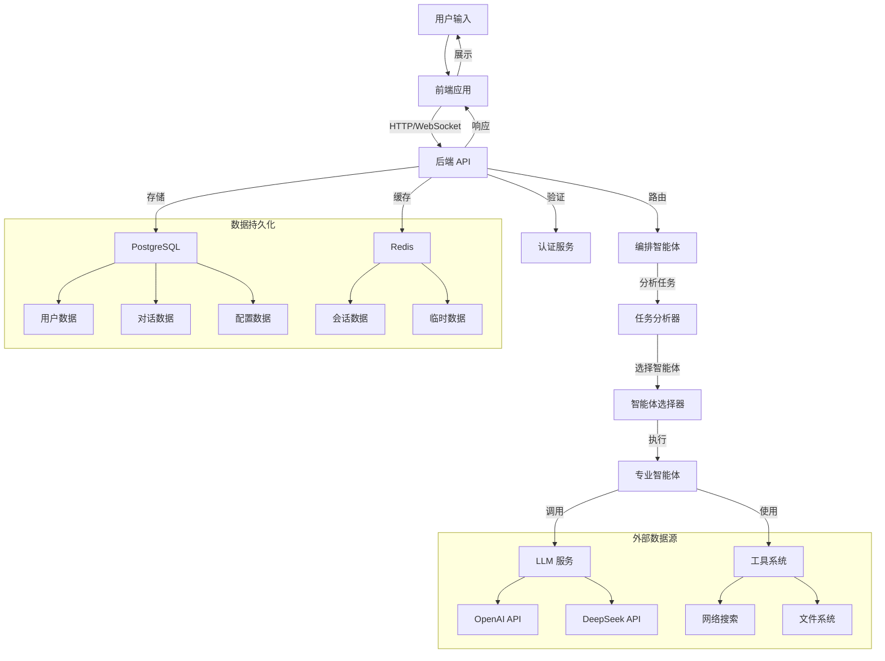
```mermaid
flowchart TD
    User[用户输入] --> Frontend[前端应用]
    Frontend --> |HTTP/WebSocket| Backend[后端 API]
    Backend --> |验证| Auth[认证服务]
    Backend --> |路由| AgentOrch[编排智能体]
    
    AgentOrch --> |分析任务| TaskAnalyzer[任务分析器]
    TaskAnalyzer --> |选择智能体| AgentSelector[智能体选择器]
    AgentSelector --> |执行| SpecificAgent[专业智能体]
    
    SpecificAgent --> |调用| LLMService[LLM 服务]
    SpecificAgent --> |使用| Tools[工具系统]
    
    Backend --> |存储| Database[PostgreSQL]
    Backend --> |缓存| Cache[Redis]
    
    Backend --> |响应| Frontend
    Frontend --> |展示| User
    
    subgraph "数据持久化"
        Database --> UserData[用户数据]
        Database --> ConversationData[对话数据]
        Database --> ConfigData[配置数据]
        Cache --> SessionData[会话数据]
        Cache --> TempData[临时数据]
    end
    
    subgraph "外部数据源"
        LLMService --> OpenAI[OpenAI API]
        LLMService --> DeepSeek[DeepSeek API]
        Tools --> WebSearch[网络搜索]
        Tools --> FileSystem[文件系统]
    end
```

### 1.4.2 数据分层模型

```mermaid
pyramid
    title 数据架构分层
    "业务数据层" : "用户数据<br/>对话记录<br/>配置信息"
    "逻辑数据层" : "实体关系<br/>业务规则<br/>数据约束"
    "物理数据层" : "表结构<br/>索引设计<br/>存储优化"
    "存储数据层" : "PostgreSQL<br/>Redis<br/>对象存储"
```

**数据分类**:
1. **核心业务数据** (PostgreSQL)
   - 用户账户信息
   - LLM 配置数据
   - 对话历史记录
   - 智能体配置

2. **缓存和会话数据** (Redis)
   - 用户会话信息
   - API 调用缓存
   - 临时任务状态
   - 实时对话上下文

3. **文件和媒体数据** (对象存储)
   - 用户上传文件
   - 智能体生成文件
   - 系统日志文件
   - 备份数据

### 1.4.3 数据一致性保证

**ACID 特性保证**:
- **原子性**: 使用数据库事务确保操作原子性
- **一致性**: 外键约束和业务规则验证
- **隔离性**: 适当的事务隔离级别
- **持久性**: 数据备份和恢复机制

**分布式一致性**:
- 最终一致性模型适用于非关键数据
- 强一致性要求的数据使用同步操作
- 缓存失效策略确保数据一致性

## 1.5 安全架构

### 1.5.1 安全层级设计

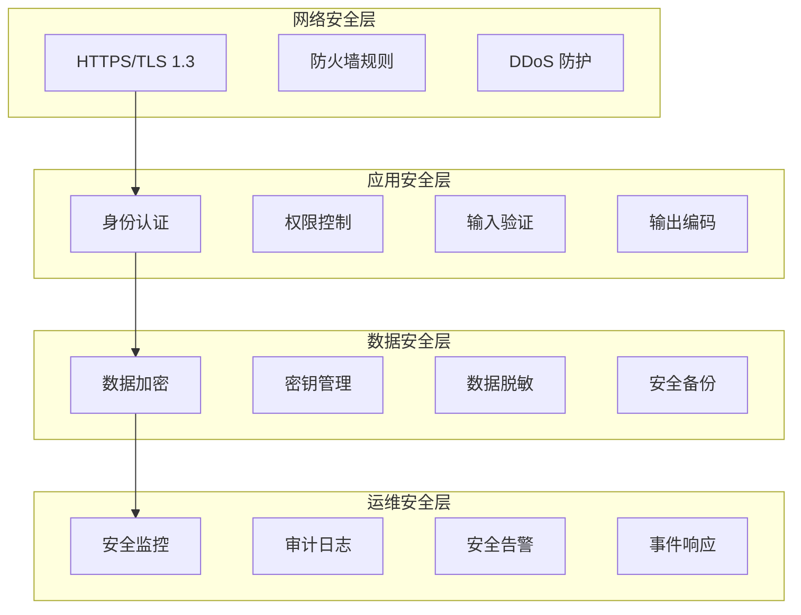
```mermaid
graph TB
    subgraph "网络安全层"
        HTTPS[HTTPS/TLS 1.3]
        Firewall[防火墙规则]
        DDoS[DDoS 防护]
    end
    
    subgraph "应用安全层"
        Auth[身份认证]
        Authorization[权限控制]
        InputValidation[输入验证]
        OutputEncoding[输出编码]
    end
    
    subgraph "数据安全层"
        Encryption[数据加密]
        KeyManagement[密钥管理]
        DataMasking[数据脱敏]
        Backup[安全备份]
    end
    
    subgraph "运维安全层"
        Monitoring[安全监控]
        Logging[审计日志]
        Alerting[安全告警]
        Incident[事件响应]
    end
    
    HTTPS --> Auth
    Auth --> Encryption
    Encryption --> Monitoring
```

### 1.5.2 认证和授权架构

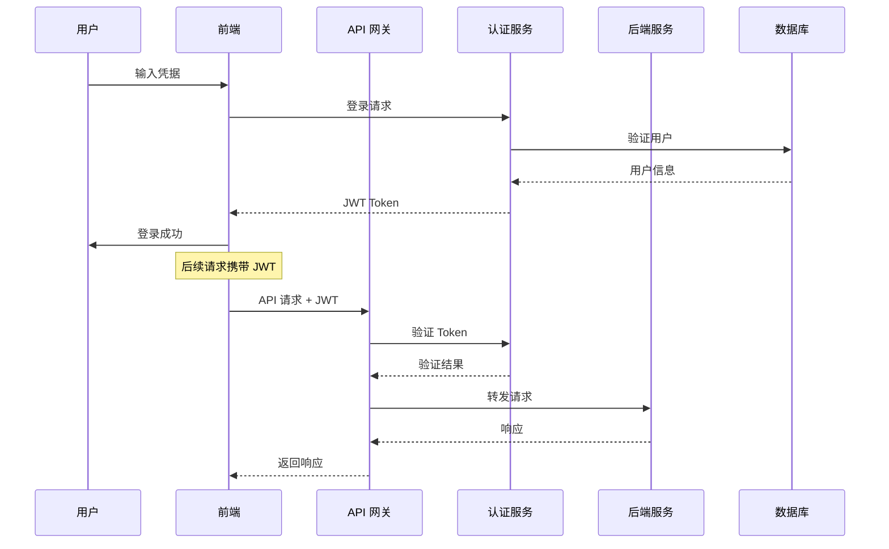
```mermaid
sequenceDiagram
    participant User as 用户
    participant Frontend as 前端
    participant Gateway as API 网关
    participant AuthService as 认证服务
    participant Backend as 后端服务
    participant DB as 数据库
    
    User->>Frontend: 输入凭据
    Frontend->>AuthService: 登录请求
    AuthService->>DB: 验证用户
    DB-->>AuthService: 用户信息
    AuthService-->>Frontend: JWT Token
    Frontend->>User: 登录成功
    
    Note over Frontend: 后续请求携带 JWT
    
    Frontend->>Gateway: API 请求 + JWT
    Gateway->>AuthService: 验证 Token
    AuthService-->>Gateway: 验证结果
    Gateway->>Backend: 转发请求
    Backend-->>Gateway: 响应
    Gateway-->>Frontend: 返回响应
```

### 1.5.3 数据保护策略

**传输中数据保护**:
- 全站 HTTPS 强制
- TLS 1.3 加密协议
- HTTP Strict Transport Security (HSTS)

**存储中数据保护**:
- 敏感数据加密存储 (AES-256)
- API 密钥专用加密
- 数据库连接加密

**使用中数据保护**:
- 内存中敏感数据及时清除
- 日志中敏感信息脱敏
- 错误信息不泄露敏感数据

---

通过以上系统架构设计，ALMA 确保了：
- **可扩展性**: 支持从单机到集群的平滑扩展
- **可靠性**: 多层次的错误处理和恢复机制
- **安全性**: 全方位的安全防护措施
- **可维护性**: 清晰的分层架构和模块划分
- **高性能**: 优化的数据流和缓存策略

---

# 2. 数据库设计

本章节详细描述 ALMA 系统的数据库设计，包括数据模型概述、核心实体设计、数据表结构、索引策略和数据迁移方案。

## 2.1 数据模型概述

### 2.1.1 实体关系图

ALMA 系统的核心数据模型围绕用户、对话、智能体和 LLM 配置展开：

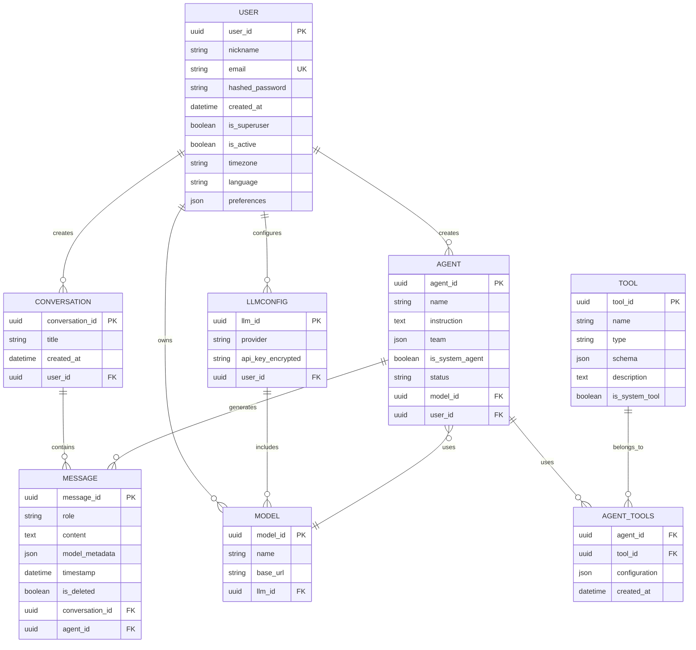
```mermaid
erDiagram
    USER ||--o{ CONVERSATION : creates
    USER ||--o{ LLMCONFIG : configures
    USER ||--o{ AGENT : creates
    USER ||--o{ MODEL : owns
    
    CONVERSATION ||--o{ MESSAGE : contains
    
    LLMCONFIG ||--o{ MODEL : includes
    
    AGENT ||--o{ MESSAGE : generates
    AGENT ||--o{ AGENT_TOOLS : uses
    AGENT }o--|| MODEL : uses
    
    TOOL ||--o{ AGENT_TOOLS : belongs_to
    
    USER {
        uuid user_id PK
        string nickname
        string email UK
        string hashed_password
        datetime created_at
        boolean is_superuser
        boolean is_active
        string timezone
        string language
        json preferences
    }
    
    CONVERSATION {
        uuid conversation_id PK
        string title
        datetime created_at
        uuid user_id FK
    }
    
    MESSAGE {
        uuid message_id PK
        string role
        text content
        json model_metadata
        datetime timestamp
        boolean is_deleted
        uuid conversation_id FK
        uuid agent_id FK
    }
    
    LLMCONFIG {
        uuid llm_id PK
        string provider
        string api_key_encrypted
        uuid user_id FK
    }
    
    MODEL {
        uuid model_id PK
        string name
        string base_url
        uuid llm_id FK
    }
    
    AGENT {
        uuid agent_id PK
        string name
        text instruction
        json team
        boolean is_system_agent
        string status
        uuid model_id FK
        uuid user_id FK
    }
    
    TOOL {
        uuid tool_id PK
        string name
        string type
        json schema
        text description
        boolean is_system_tool
    }
    
    AGENT_TOOLS {
        uuid agent_id FK
        uuid tool_id FK
        json configuration
        datetime created_at
    }
```

### 2.1.2 数据分层架构

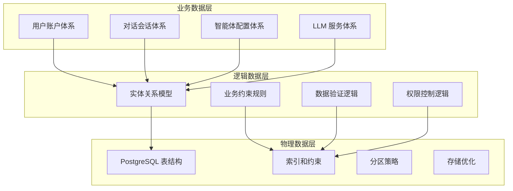
```mermaid
graph TB
    subgraph "业务数据层"
        A1[用户账户体系]
        A2[对话会话体系]
        A3[智能体配置体系]
        A4[LLM 服务体系]
    end
    
    subgraph "逻辑数据层"
        B1[实体关系模型]
        B2[业务约束规则]
        B3[数据验证逻辑]
        B4[权限控制逻辑]
    end
    
    subgraph "物理数据层"
        C1[PostgreSQL 表结构]
        C2[索引和约束]
        C3[分区策略]
        C4[存储优化]
    end
    
    A1 --> B1
    A2 --> B1
    A3 --> B1
    A4 --> B1
    
    B1 --> C1
    B2 --> C2
    B3 --> C2
    B4 --> C2
```

### 2.1.3 数据生命周期

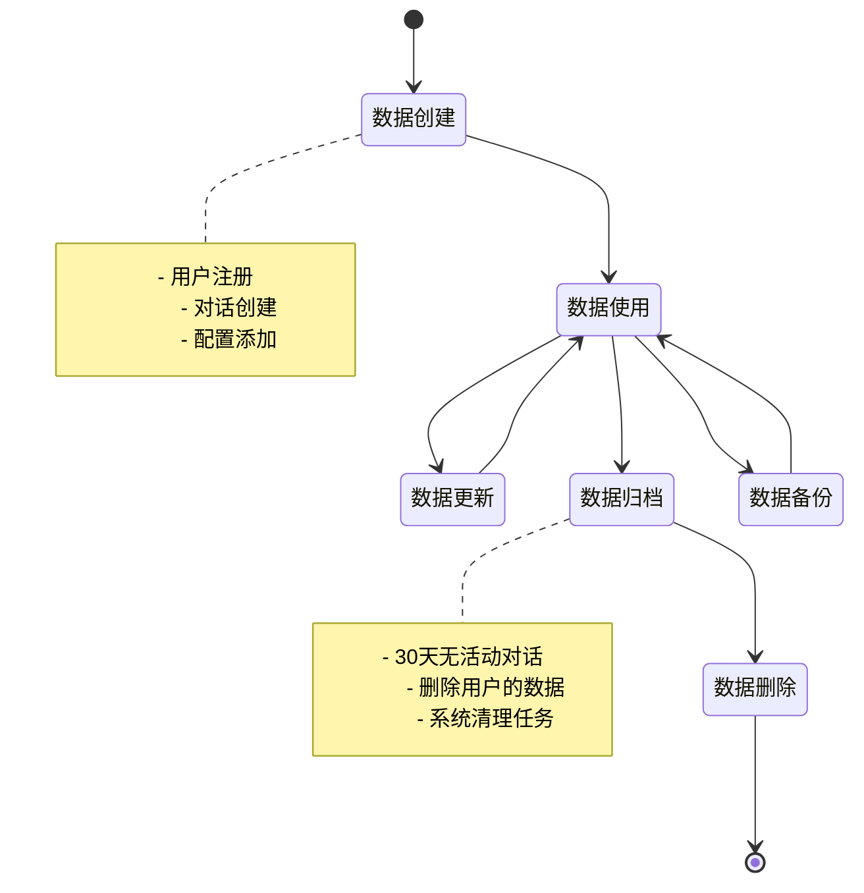
```mermaid
stateDiagram-v2
    [*] --> 数据创建
    数据创建 --> 数据使用
    数据使用 --> 数据更新
    数据更新 --> 数据使用
    数据使用 --> 数据归档
    数据归档 --> 数据删除
    数据删除 --> [*]
    
    数据使用 --> 数据备份
    数据备份 --> 数据使用
    
    note right of 数据创建
        - 用户注册
        - 对话创建
        - 配置添加
    end note
    
    note right of 数据归档
        - 30天无活动对话
        - 删除用户的数据
        - 系统清理任务
    end note
```

## 2.2 核心实体设计

### 2.2.1 用户实体 (User)

**设计原则**：
- 用户数据隐私保护
- 支持国际化和本地化
- 可扩展的偏好设置

```python
class User(SQLModel, table=True):
    # 主键和基本信息
    user_id: uuid.UUID = Field(default_factory=uuid.uuid4, primary_key=True)
    nickname: str = Field(default_factory=generate_default_nickname, max_length=50)
    email: EmailStr = Field(unique=True, index=True, max_length=255)
    hashed_password: str = Field(min_length=60, max_length=255)  # bcrypt hash
    
    # 状态和权限
    created_at: datetime = Field(default_factory=lambda: datetime.now(timezone.utc))
    last_login_at: datetime | None = Field(default=None)
    is_superuser: bool = Field(default=False)
    is_active: bool = Field(default=False)  # 需要邮箱验证激活
    
    # 用户偏好
    timezone: str = Field(default="UTC+8:00", max_length=50)
    language: str = Field(default="zh", max_length=10)
    preferences: dict[str, Any] | None = Field(default=None, sa_type=JSON)
    
    # 统计信息
    total_conversations: int = Field(default=0)
    total_messages: int = Field(default=0)
```

**偏好设置结构**：
```json
{
  "theme": "dark",
  "message_display": {
    "show_timestamps": true,
    "auto_scroll": true,
    "message_grouping": true
  },
  "notifications": {
    "email_enabled": true,
    "desktop_enabled": false
  },
  "ai_settings": {
    "default_model": "gpt-4",
    "temperature": 0.7,
    "max_tokens": 2000
  }
}
```

### 2.2.2 对话实体 (Conversation)

**设计原则**：
- 支持大量历史对话
- 快速检索和分页
- 支持对话元数据

```python
class Conversation(SQLModel, table=True):
    # 主键和基本信息
    conversation_id: uuid.UUID = Field(default_factory=uuid.uuid4, primary_key=True)
    title: str = Field(default="New Chat", max_length=200)
    summary: str | None = Field(default=None, max_length=500)  # AI 生成摘要
    
    # 时间信息
    created_at: datetime = Field(default_factory=lambda: datetime.now(timezone.utc))
    updated_at: datetime = Field(default_factory=lambda: datetime.now(timezone.utc))
    last_message_at: datetime | None = Field(default=None)
    
    # 状态信息
    is_pinned: bool = Field(default=False)
    is_archived: bool = Field(default=False)
    message_count: int = Field(default=0)
    
    # 外键关系
    user_id: uuid.UUID = Field(foreign_key="user.user_id", index=True, ondelete="CASCADE")
    
    # 元数据
    tags: list[str] | None = Field(default=None, sa_type=JSON)
    metadata: dict[str, Any] | None = Field(default=None, sa_type=JSON)
```

### 2.2.3 消息实体 (Message)

**设计原则**：
- 支持多种消息类型
- 保留完整的对话上下文
- 支持流式消息和富媒体

```python
class Message(SQLModel, table=True):
    # 主键和基本信息
    message_id: uuid.UUID = Field(default_factory=uuid.uuid4, primary_key=True)
    role: str = Field(max_length=20)  # "user", "assistant", "system", "tool"
    content: str = Field(sa_type=Text)
    content_type: str = Field(default="text", max_length=20)  # "text", "code", "image", "file"
    
    # 消息元数据
    model_metadata: dict[str, Any] | None = Field(default=None, sa_type=JSON)
    tool_calls: list[dict[str, Any]] | None = Field(default=None, sa_type=JSON)
    attachments: list[dict[str, Any]] | None = Field(default=None, sa_type=JSON)
    
    # 时间和状态
    timestamp: datetime = Field(default_factory=lambda: datetime.now(timezone.utc))
    is_deleted: bool = Field(default=False)
    is_edited: bool = Field(default=False)
    edit_count: int = Field(default=0)
    
    # 外键关系
    conversation_id: uuid.UUID = Field(
        foreign_key="conversation.conversation_id", index=True, ondelete="CASCADE"
    )
    agent_id: uuid.UUID | None = Field(default=None, foreign_key="agent.agent_id")
    parent_message_id: uuid.UUID | None = Field(default=None, foreign_key="message.message_id")
```

**消息元数据结构**：
```json
{
  "model": "gpt-4",
  "provider": "openai",
  "usage": {
    "prompt_tokens": 150,
    "completion_tokens": 300,
    "total_tokens": 450
  },
  "response_time": 2.5,
  "temperature": 0.7,
  "finish_reason": "stop"
}
```

### 2.2.4 LLM 配置实体 (LLMConfig & Model)

**设计原则**：
- 支持多种 LLM 提供商
- 安全的 API 密钥存储
- 灵活的模型配置

```python
class LLMConfig(SQLModel, table=True):
    # 主键和基本信息
    llm_id: uuid.UUID = Field(default_factory=uuid.uuid4, primary_key=True)
    provider: str = Field(max_length=50)  # "openai", "deepseek", "azure", "custom"
    provider_name: str = Field(max_length=100)  # 用户自定义名称
    
    # 认证信息
    api_key_encrypted: str = Field(max_length=500)  # 加密存储的 API Key
    api_base_url: str | None = Field(default=None, max_length=500)
    organization_id: str | None = Field(default=None, max_length=100)
    
    # 状态和配置
    is_active: bool = Field(default=True)
    is_default: bool = Field(default=False)
    created_at: datetime = Field(default_factory=lambda: datetime.now(timezone.utc))
    last_tested_at: datetime | None = Field(default=None)
    test_status: str = Field(default="pending", max_length=20)  # "success", "failed", "pending"
    
    # 限制和配额
    rate_limit: dict[str, Any] | None = Field(default=None, sa_type=JSON)
    usage_statistics: dict[str, Any] | None = Field(default=None, sa_type=JSON)
    
    # 外键关系
    user_id: uuid.UUID = Field(foreign_key="user.user_id", ondelete="CASCADE")

class Model(SQLModel, table=True):
    # 主键和基本信息
    model_id: uuid.UUID = Field(default_factory=uuid.uuid4, primary_key=True)
    name: str = Field(max_length=100)  # "gpt-4", "gpt-3.5-turbo", "deepseek-chat"
    display_name: str = Field(max_length=100)  # 用户友好的显示名称
    
    # 模型配置
    base_url: str | None = Field(default=None, max_length=500)
    model_type: str = Field(default="chat", max_length=20)  # "chat", "completion", "embedding"
    context_window: int | None = Field(default=None)  # 上下文窗口大小
    max_tokens: int | None = Field(default=None)  # 最大生成 tokens
    
    # 定价信息
    pricing: dict[str, Any] | None = Field(default=None, sa_type=JSON)
    
    # 状态
    is_active: bool = Field(default=True)
    created_at: datetime = Field(default_factory=lambda: datetime.now(timezone.utc))
    
    # 外键关系
    llm_id: uuid.UUID = Field(foreign_key="llmconfig.llm_id", ondelete="CASCADE")
```

### 2.2.5 智能体实体 (Agent)

**设计原则**：
- 系统智能体和用户智能体分离
- 支持智能体团队协作
- 灵活的工具配置

```python
class Agent(SQLModel, table=True):
    # 主键和基本信息
    agent_id: uuid.UUID = Field(default_factory=uuid.uuid4, primary_key=True)
    name: str = Field(max_length=100)
    display_name: str = Field(max_length=100)
    description: str | None = Field(default=None, max_length=500)
    
    # 智能体配置
    instruction: str = Field(sa_type=Text)  # 系统提示词
    team: list[str] | None = Field(default=None, sa_type=JSON)  # 协作团队
    capabilities: list[str] | None = Field(default=None, sa_type=JSON)  # 能力列表
    
    # 智能体类型和状态
    agent_type: str = Field(default="custom", max_length=20)  # "system", "custom", "shared"
    is_system_agent: bool = Field(default=False)
    status: str = Field(default="active", max_length=20)  # "active", "disabled", "archived"
    
    # 配置参数
    parameters: dict[str, Any] | None = Field(default=None, sa_type=JSON)
    
    # 统计信息
    usage_count: int = Field(default=0)
    success_rate: float = Field(default=0.0)
    average_response_time: float = Field(default=0.0)
    
    # 时间信息
    created_at: datetime = Field(default_factory=lambda: datetime.now(timezone.utc))
    updated_at: datetime = Field(default_factory=lambda: datetime.now(timezone.utc))
    last_used_at: datetime | None = Field(default=None)
    
    # 外键关系
    model_id: uuid.UUID | None = Field(default=None, foreign_key="model.model_id")
    user_id: uuid.UUID | None = Field(
        default=None, foreign_key="user.user_id", ondelete="CASCADE"
    )
```

### 2.2.6 工具系统实体 (Tool & AgentTools)

**设计原则**：
- 标准化的工具接口
- 支持工具组合和配置
- 系统工具和自定义工具分离

```python
class Tool(SQLModel, table=True):
    # 主键和基本信息
    tool_id: uuid.UUID = Field(default_factory=uuid.uuid4, primary_key=True)
    name: str = Field(max_length=100, unique=True)
    display_name: str = Field(max_length=100)
    description: str = Field(sa_type=Text)
    
    # 工具配置
    tool_type: str = Field(max_length=50)  # "file", "web", "code", "system"
    schema: dict[str, Any] = Field(sa_type=JSON)  # JSON Schema 定义
    implementation: str = Field(sa_type=Text)  # 实现代码或配置
    
    # 权限和安全
    is_system_tool: bool = Field(default=True)
    requires_auth: bool = Field(default=False)
    security_level: str = Field(default="safe", max_length=20)  # "safe", "restricted", "dangerous"
    
    # 状态
    is_active: bool = Field(default=True)
    version: str = Field(default="1.0.0", max_length=20)
    created_at: datetime = Field(default_factory=lambda: datetime.now(timezone.utc))

class AgentTools(SQLModel, table=True):
    # 复合主键
    agent_id: uuid.UUID = Field(foreign_key="agent.agent_id", primary_key=True)
    tool_id: uuid.UUID = Field(foreign_key="tool.tool_id", primary_key=True)
    
    # 工具配置
    configuration: dict[str, Any] | None = Field(default=None, sa_type=JSON)
    is_enabled: bool = Field(default=True)
    
    # 统计信息
    usage_count: int = Field(default=0)
    last_used_at: datetime | None = Field(default=None)
    
    # 时间信息
    created_at: datetime = Field(default_factory=lambda: datetime.now(timezone.utc))
```

## 2.3 数据表结构

### 2.3.1 表空间和分区策略

```sql
-- 用户相关表 (小表，不需要分区)
CREATE TABLE users (
    user_id UUID PRIMARY KEY DEFAULT gen_random_uuid(),
    nickname VARCHAR(50) NOT NULL,
    email VARCHAR(255) UNIQUE NOT NULL,
    hashed_password VARCHAR(255) NOT NULL,
    created_at TIMESTAMP WITH TIME ZONE DEFAULT NOW(),
    last_login_at TIMESTAMP WITH TIME ZONE,
    is_superuser BOOLEAN DEFAULT FALSE,
    is_active BOOLEAN DEFAULT FALSE,
    timezone VARCHAR(50) DEFAULT 'UTC+8:00',
    language VARCHAR(10) DEFAULT 'zh',
    preferences JSONB,
    total_conversations INTEGER DEFAULT 0,
    total_messages INTEGER DEFAULT 0
);

-- 对话表 (按月分区)
CREATE TABLE conversations (
    conversation_id UUID PRIMARY KEY DEFAULT gen_random_uuid(),
    title VARCHAR(200) NOT NULL DEFAULT 'New Chat',
    summary VARCHAR(500),
    created_at TIMESTAMP WITH TIME ZONE DEFAULT NOW(),
    updated_at TIMESTAMP WITH TIME ZONE DEFAULT NOW(),
    last_message_at TIMESTAMP WITH TIME ZONE,
    is_pinned BOOLEAN DEFAULT FALSE,
    is_archived BOOLEAN DEFAULT FALSE,
    message_count INTEGER DEFAULT 0,
    user_id UUID NOT NULL REFERENCES users(user_id) ON DELETE CASCADE,
    tags JSONB,
    metadata JSONB
) PARTITION BY RANGE (created_at);

-- 消息表 (按月分区，按对话ID哈希)
CREATE TABLE messages (
    message_id UUID PRIMARY KEY DEFAULT gen_random_uuid(),
    role VARCHAR(20) NOT NULL,
    content TEXT NOT NULL,
    content_type VARCHAR(20) DEFAULT 'text',
    model_metadata JSONB,
    tool_calls JSONB,
    attachments JSONB,
    timestamp TIMESTAMP WITH TIME ZONE DEFAULT NOW(),
    is_deleted BOOLEAN DEFAULT FALSE,
    is_edited BOOLEAN DEFAULT FALSE,
    edit_count INTEGER DEFAULT 0,
    conversation_id UUID NOT NULL REFERENCES conversations(conversation_id) ON DELETE CASCADE,
    agent_id UUID REFERENCES agents(agent_id),
    parent_message_id UUID REFERENCES messages(message_id)
) PARTITION BY RANGE (timestamp);
```

### 2.3.2 分区创建脚本

```sql
-- 创建对话表分区 (按月)
CREATE TABLE conversations_2025_01 PARTITION OF conversations
FOR VALUES FROM ('2025-01-01') TO ('2025-02-01');

CREATE TABLE conversations_2025_02 PARTITION OF conversations
FOR VALUES FROM ('2025-02-01') TO ('2025-03-01');

-- 创建消息表分区 (按月)
CREATE TABLE messages_2025_01 PARTITION OF messages
FOR VALUES FROM ('2025-01-01') TO ('2025-02-01');

CREATE TABLE messages_2025_02 PARTITION OF messages
FOR VALUES FROM ('2025-02-01') TO ('2025-03-01');

-- 自动创建分区的函数
CREATE OR REPLACE FUNCTION create_monthly_partitions()
RETURNS void AS $$
DECLARE
    start_date date;
    end_date date;
    table_name text;
BEGIN
    start_date := date_trunc('month', CURRENT_DATE);
    end_date := start_date + interval '1 month';
    
    -- 创建对话表分区
    table_name := 'conversations_' || to_char(start_date, 'YYYY_MM');
    EXECUTE format('CREATE TABLE IF NOT EXISTS %I PARTITION OF conversations
                    FOR VALUES FROM (%L) TO (%L)', 
                   table_name, start_date, end_date);
    
    -- 创建消息表分区
    table_name := 'messages_' || to_char(start_date, 'YYYY_MM');
    EXECUTE format('CREATE TABLE IF NOT EXISTS %I PARTITION OF messages
                    FOR VALUES FROM (%L) TO (%L)', 
                   table_name, start_date, end_date);
END;
$$ LANGUAGE plpgsql;
```

### 2.3.3 完整的 DDL 语句

```sql
-- 启用 UUID 扩展
CREATE EXTENSION IF NOT EXISTS "uuid-ossp";
CREATE EXTENSION IF NOT EXISTS "pgcrypto";

-- 用户表
CREATE TABLE users (
    user_id UUID PRIMARY KEY DEFAULT gen_random_uuid(),
    nickname VARCHAR(50) NOT NULL,
    email VARCHAR(255) UNIQUE NOT NULL,
    hashed_password VARCHAR(255) NOT NULL,
    created_at TIMESTAMP WITH TIME ZONE DEFAULT NOW(),
    last_login_at TIMESTAMP WITH TIME ZONE,
    is_superuser BOOLEAN DEFAULT FALSE,
    is_active BOOLEAN DEFAULT FALSE,
    timezone VARCHAR(50) DEFAULT 'UTC+8:00',
    language VARCHAR(10) DEFAULT 'zh',
    preferences JSONB,
    total_conversations INTEGER DEFAULT 0,
    total_messages INTEGER DEFAULT 0
);

-- LLM 配置表
CREATE TABLE llmconfigs (
    llm_id UUID PRIMARY KEY DEFAULT gen_random_uuid(),
    provider VARCHAR(50) NOT NULL,
    provider_name VARCHAR(100) NOT NULL,
    api_key_encrypted VARCHAR(500) NOT NULL,
    api_base_url VARCHAR(500),
    organization_id VARCHAR(100),
    is_active BOOLEAN DEFAULT TRUE,
    is_default BOOLEAN DEFAULT FALSE,
    created_at TIMESTAMP WITH TIME ZONE DEFAULT NOW(),
    last_tested_at TIMESTAMP WITH TIME ZONE,
    test_status VARCHAR(20) DEFAULT 'pending',
    rate_limit JSONB,
    usage_statistics JSONB,
    user_id UUID NOT NULL REFERENCES users(user_id) ON DELETE CASCADE
);

-- 模型表
CREATE TABLE models (
    model_id UUID PRIMARY KEY DEFAULT gen_random_uuid(),
    name VARCHAR(100) NOT NULL,
    display_name VARCHAR(100) NOT NULL,
    base_url VARCHAR(500),
    model_type VARCHAR(20) DEFAULT 'chat',
    context_window INTEGER,
    max_tokens INTEGER,
    pricing JSONB,
    is_active BOOLEAN DEFAULT TRUE,
    created_at TIMESTAMP WITH TIME ZONE DEFAULT NOW(),
    llm_id UUID NOT NULL REFERENCES llmconfigs(llm_id) ON DELETE CASCADE
);

-- 工具表
CREATE TABLE tools (
    tool_id UUID PRIMARY KEY DEFAULT gen_random_uuid(),
    name VARCHAR(100) UNIQUE NOT NULL,
    display_name VARCHAR(100) NOT NULL,
    description TEXT NOT NULL,
    tool_type VARCHAR(50) NOT NULL,
    schema JSONB NOT NULL,
    implementation TEXT NOT NULL,
    is_system_tool BOOLEAN DEFAULT TRUE,
    requires_auth BOOLEAN DEFAULT FALSE,
    security_level VARCHAR(20) DEFAULT 'safe',
    is_active BOOLEAN DEFAULT TRUE,
    version VARCHAR(20) DEFAULT '1.0.0',
    created_at TIMESTAMP WITH TIME ZONE DEFAULT NOW()
);

-- 智能体表
CREATE TABLE agents (
    agent_id UUID PRIMARY KEY DEFAULT gen_random_uuid(),
    name VARCHAR(100) NOT NULL,
    display_name VARCHAR(100) NOT NULL,
    description VARCHAR(500),
    instruction TEXT NOT NULL,
    team JSONB,
    capabilities JSONB,
    agent_type VARCHAR(20) DEFAULT 'custom',
    is_system_agent BOOLEAN DEFAULT FALSE,
    status VARCHAR(20) DEFAULT 'active',
    parameters JSONB,
    usage_count INTEGER DEFAULT 0,
    success_rate REAL DEFAULT 0.0,
    average_response_time REAL DEFAULT 0.0,
    created_at TIMESTAMP WITH TIME ZONE DEFAULT NOW(),
    updated_at TIMESTAMP WITH TIME ZONE DEFAULT NOW(),
    last_used_at TIMESTAMP WITH TIME ZONE,
    model_id UUID REFERENCES models(model_id),
    user_id UUID REFERENCES users(user_id) ON DELETE CASCADE
);

-- 智能体工具关联表
CREATE TABLE agent_tools (
    agent_id UUID NOT NULL REFERENCES agents(agent_id) ON DELETE CASCADE,
    tool_id UUID NOT NULL REFERENCES tools(tool_id) ON DELETE CASCADE,
    configuration JSONB,
    is_enabled BOOLEAN DEFAULT TRUE,
    usage_count INTEGER DEFAULT 0,
    last_used_at TIMESTAMP WITH TIME ZONE,
    created_at TIMESTAMP WITH TIME ZONE DEFAULT NOW(),
    PRIMARY KEY (agent_id, tool_id)
);

-- 对话表 (分区表)
CREATE TABLE conversations (
    conversation_id UUID PRIMARY KEY DEFAULT gen_random_uuid(),
    title VARCHAR(200) NOT NULL DEFAULT 'New Chat',
    summary VARCHAR(500),
    created_at TIMESTAMP WITH TIME ZONE DEFAULT NOW(),
    updated_at TIMESTAMP WITH TIME ZONE DEFAULT NOW(),
    last_message_at TIMESTAMP WITH TIME ZONE,
    is_pinned BOOLEAN DEFAULT FALSE,
    is_archived BOOLEAN DEFAULT FALSE,
    message_count INTEGER DEFAULT 0,
    user_id UUID NOT NULL REFERENCES users(user_id) ON DELETE CASCADE,
    tags JSONB,
    metadata JSONB
) PARTITION BY RANGE (created_at);

-- 消息表 (分区表)
CREATE TABLE messages (
    message_id UUID PRIMARY KEY DEFAULT gen_random_uuid(),
    role VARCHAR(20) NOT NULL,
    content TEXT NOT NULL,
    content_type VARCHAR(20) DEFAULT 'text',
    model_metadata JSONB,
    tool_calls JSONB,
    attachments JSONB,
    timestamp TIMESTAMP WITH TIME ZONE DEFAULT NOW(),
    is_deleted BOOLEAN DEFAULT FALSE,
    is_edited BOOLEAN DEFAULT FALSE,
    edit_count INTEGER DEFAULT 0,
    conversation_id UUID NOT NULL REFERENCES conversations(conversation_id) ON DELETE CASCADE,
    agent_id UUID REFERENCES agents(agent_id),
    parent_message_id UUID REFERENCES messages(message_id)
) PARTITION BY RANGE (timestamp);
```

## 2.4 索引策略

### 2.4.1 主要索引设计

```sql
-- 用户表索引
CREATE INDEX idx_users_email ON users(email);
CREATE INDEX idx_users_created_at ON users(created_at);
CREATE INDEX idx_users_is_active ON users(is_active) WHERE is_active = true;

-- LLM 配置表索引
CREATE INDEX idx_llmconfigs_user_id ON llmconfigs(user_id);
CREATE INDEX idx_llmconfigs_provider ON llmconfigs(provider);
CREATE INDEX idx_llmconfigs_is_active ON llmconfigs(is_active) WHERE is_active = true;
CREATE INDEX idx_llmconfigs_is_default ON llmconfigs(is_default, user_id) WHERE is_default = true;

-- 模型表索引
CREATE INDEX idx_models_llm_id ON models(llm_id);
CREATE INDEX idx_models_name ON models(name);
CREATE INDEX idx_models_is_active ON models(is_active) WHERE is_active = true;

-- 智能体表索引
CREATE INDEX idx_agents_user_id ON agents(user_id);
CREATE INDEX idx_agents_model_id ON agents(model_id);
CREATE INDEX idx_agents_type_status ON agents(agent_type, status);
CREATE INDEX idx_agents_is_system ON agents(is_system_agent) WHERE is_system_agent = true;
CREATE INDEX idx_agents_last_used ON agents(last_used_at DESC NULLS LAST);

-- 工具表索引
CREATE INDEX idx_tools_type ON tools(tool_type);
CREATE INDEX idx_tools_is_system ON tools(is_system_tool);
CREATE INDEX idx_tools_security_level ON tools(security_level);

-- 对话表索引 (在每个分区上创建)
CREATE INDEX idx_conversations_user_id ON conversations(user_id);
CREATE INDEX idx_conversations_created_at ON conversations(created_at DESC);
CREATE INDEX idx_conversations_updated_at ON conversations(updated_at DESC);
CREATE INDEX idx_conversations_is_pinned ON conversations(is_pinned) WHERE is_pinned = true;
CREATE INDEX idx_conversations_is_archived ON conversations(is_archived);
CREATE INDEX idx_conversations_tags ON conversations USING GIN(tags);

-- 消息表索引 (在每个分区上创建)
CREATE INDEX idx_messages_conversation_id ON messages(conversation_id);
CREATE INDEX idx_messages_timestamp ON messages(timestamp DESC);
CREATE INDEX idx_messages_role ON messages(role);
CREATE INDEX idx_messages_agent_id ON messages(agent_id);
CREATE INDEX idx_messages_is_deleted ON messages(is_deleted) WHERE is_deleted = false;
CREATE INDEX idx_messages_content_fts ON messages USING GIN(to_tsvector('english', content));
```

### 2.4.2 复合索引设计

```sql
-- 用户对话查询优化
CREATE INDEX idx_conversations_user_time ON conversations(user_id, created_at DESC);
CREATE INDEX idx_conversations_user_active ON conversations(user_id, is_archived) 
    WHERE is_archived = false;

-- 对话消息查询优化
CREATE INDEX idx_messages_conv_time ON messages(conversation_id, timestamp);
CREATE INDEX idx_messages_conv_role ON messages(conversation_id, role);

-- 智能体使用统计优化
CREATE INDEX idx_agents_usage_stats ON agents(user_id, usage_count DESC, last_used_at DESC);

-- LLM 配置查询优化
CREATE INDEX idx_llmconfigs_user_active ON llmconfigs(user_id, is_active) 
    WHERE is_active = true;

-- 工具使用统计优化
CREATE INDEX idx_agent_tools_usage ON agent_tools(tool_id, usage_count DESC);
```

### 2.4.3 JSONB 索引优化

```sql
-- 用户偏好设置查询
CREATE INDEX idx_users_preferences_theme ON users 
    USING GIN ((preferences->'theme'));

-- 消息元数据查询
CREATE INDEX idx_messages_model_metadata ON messages 
    USING GIN (model_metadata);

-- 智能体参数查询
CREATE INDEX idx_agents_parameters ON agents 
    USING GIN (parameters);

-- 对话标签查询
CREATE INDEX idx_conversations_tags_gin ON conversations 
    USING GIN (tags);
```

## 2.5 数据迁移方案

### 2.5.1 Alembic 配置

基于现有的 Alembic 配置，完善迁移管理：

```python
# alembic/env.py 关键配置
from app.core.config import settings
from app.models import *  # 导入所有模型

target_metadata = SQLModel.metadata

def run_migrations_online():
    """Run migrations in 'online' mode."""
    connectable = create_engine(
        settings.DATABASE_URL,
        poolclass=pool.NullPool,
        echo=settings.DATABASE_ECHO,
    )

    with connectable.connect() as connection:
        context.configure(
            connection=connection,
            target_metadata=target_metadata,
            compare_type=True,
            compare_server_default=True,
            render_as_batch=True,
        )

        with context.begin_transaction():
            context.run_migrations()
```

### 2.5.2 关键迁移脚本

```python
# 创建初始表结构的迁移
"""创建基础表结构

Revision ID: 001_initial_tables
Revises: 
Create Date: 2025-06-24 10:00:00.000000

"""
from alembic import op
import sqlalchemy as sa
import sqlmodel
from sqlalchemy.dialects import postgresql

revision = '001_initial_tables'
down_revision = None
branch_labels = None
depends_on = None

def upgrade():
    # 启用扩展
    op.execute('CREATE EXTENSION IF NOT EXISTS "uuid-ossp"')
    op.execute('CREATE EXTENSION IF NOT EXISTS "pgcrypto"')
    
    # 创建用户表
    op.create_table('users',
        sa.Column('user_id', postgresql.UUID(), nullable=False),
        sa.Column('nickname', sa.String(length=50), nullable=False),
        sa.Column('email', sa.String(length=255), nullable=False),
        sa.Column('hashed_password', sa.String(length=255), nullable=False),
        sa.Column('created_at', sa.DateTime(timezone=True), nullable=False),
        sa.Column('last_login_at', sa.DateTime(timezone=True), nullable=True),
        sa.Column('is_superuser', sa.Boolean(), nullable=False),
        sa.Column('is_active', sa.Boolean(), nullable=False),
        sa.Column('timezone', sa.String(length=50), nullable=False),
        sa.Column('language', sa.String(length=10), nullable=False),
        sa.Column('preferences', postgresql.JSONB(), nullable=True),
        sa.Column('total_conversations', sa.Integer(), nullable=False),
        sa.Column('total_messages', sa.Integer(), nullable=False),
        sa.PrimaryKeyConstraint('user_id'),
        sa.UniqueConstraint('email')
    )
    
    # 创建索引
    op.create_index('idx_users_email', 'users', ['email'])
    op.create_index('idx_users_created_at', 'users', ['created_at'])
    
    # ... 其他表的创建

def downgrade():
    # 删除所有表和索引
    op.drop_table('users')
    # ... 其他表的删除
```

### 2.5.3 数据迁移工具

```python
# scripts/data_migration.py
"""数据迁移和清理工具"""

import asyncio
from datetime import datetime, timedelta
from sqlmodel import select
from app.db.session import get_session
from app.models import *

async def migrate_legacy_data():
    """迁移历史数据"""
    async with get_session() as session:
        # 示例：迁移旧格式的用户偏好设置
        users = await session.exec(select(User).where(User.preferences.is_(None)))
        
        for user in users:
            user.preferences = {
                "theme": "light",
                "language": user.language,
                "notifications": {"email_enabled": True}
            }
            session.add(user)
        
        await session.commit()

async def cleanup_old_data():
    """清理过期数据"""
    async with get_session() as session:
        # 清理 30 天前的归档对话
        cutoff_date = datetime.utcnow() - timedelta(days=30)
        
        old_conversations = await session.exec(
            select(Conversation).where(
                Conversation.is_archived == True,
                Conversation.updated_at < cutoff_date
            )
        )
        
        for conv in old_conversations:
            await session.delete(conv)
        
        await session.commit()

async def create_system_agents():
    """创建系统预置智能体"""
    async with get_session() as session:
        system_agents = [
            {
                "name": "orchestrator",
                "display_name": "编排智能体",
                "description": "负责任务分析和智能体调度",
                "instruction": "你是一个智能体编排器...",
                "agent_type": "system",
                "is_system_agent": True,
                "capabilities": ["task_analysis", "agent_routing", "context_management"]
            },
            {
                "name": "coding_agent",
                "display_name": "编程智能体",
                "description": "负责代码编写和程序执行",
                "instruction": "你是一个编程专家...",
                "agent_type": "system",
                "is_system_agent": True,
                "capabilities": ["code_generation", "code_execution", "debugging"]
            },
            # ... 其他系统智能体
        ]
        
        for agent_data in system_agents:
            existing = await session.exec(
                select(Agent).where(Agent.name == agent_data["name"])
            )
            if not existing.first():
                agent = Agent(**agent_data)
                session.add(agent)
        
        await session.commit()

if __name__ == "__main__":
    asyncio.run(migrate_legacy_data())
    asyncio.run(cleanup_old_data())
    asyncio.run(create_system_agents())
```

### 2.5.4 数据备份和恢复

```bash
#!/bin/bash
# scripts/backup_database.sh

# 数据库备份脚本
BACKUP_DIR="/opt/alma/backups"
TIMESTAMP=$(date +"%Y%m%d_%H%M%S")
DB_NAME="alma_db"
DB_USER="alma_user"

# 创建备份目录
mkdir -p $BACKUP_DIR

# 全量备份
pg_dump -h localhost -U $DB_USER -d $DB_NAME \
    --format=custom \
    --compress=9 \
    --file="$BACKUP_DIR/alma_full_$TIMESTAMP.dump"

# 仅架构备份
pg_dump -h localhost -U $DB_USER -d $DB_NAME \
    --schema-only \
    --format=plain \
    --file="$BACKUP_DIR/alma_schema_$TIMESTAMP.sql"

# 清理 7 天前的备份
find $BACKUP_DIR -name "*.dump" -mtime +7 -delete
find $BACKUP_DIR -name "*.sql" -mtime +7 -delete

echo "备份完成: $TIMESTAMP"
```

```bash
#!/bin/bash
# scripts/restore_database.sh

# 数据库恢复脚本
BACKUP_FILE=$1
DB_NAME="alma_db"
DB_USER="alma_user"

if [ -z "$BACKUP_FILE" ]; then
    echo "用法: $0 <备份文件路径>"
    exit 1
fi

# 恢复数据库
pg_restore -h localhost -U $DB_USER -d $DB_NAME \
    --clean \
    --if-exists \
    --verbose \
    $BACKUP_FILE

echo "恢复完成: $BACKUP_FILE"
```

---

通过以上数据库设计，ALMA 系统确保了：
- **数据完整性**: 完善的外键约束和数据验证
- **查询性能**: 针对性的索引策略和分区设计
- **可扩展性**: 支持分区和水平扩展
- **数据安全**: 加密存储和备份恢复机制
- **维护便利**: 完善的迁移和管理工具

---

# 3. API 接口设计

本章节详细描述 ALMA 系统的 API 接口设计，包括 RESTful API 设计原则、各模块接口规范、WebSocket 通信协议和 API 安全机制。

## 3.1 API 设计原则

### 3.1.1 RESTful 设计规范

**资源命名规范**：
```yaml
命名原则:
  - 使用复数名词: /users, /conversations, /messages
  - 小写字母和连字符: /llm-configs, /agent-tools
  - 避免动词: GET /users 而不是 GET /get-users
  - 层级关系: /conversations/{id}/messages

HTTP 方法映射:
  GET: 获取资源 (幂等)
  POST: 创建资源 (非幂等)
  PUT: 完整更新资源 (幂等)
  PATCH: 部分更新资源 (幂等)
  DELETE: 删除资源 (幂等)
```

**URL 路径设计**：
```
# 基础 URL 结构
https://api.alma.example.com/v1/{resource}

# 资源集合和单个资源
GET    /v1/users              # 获取用户列表
POST   /v1/users              # 创建用户
GET    /v1/users/{user_id}    # 获取特定用户
PUT    /v1/users/{user_id}    # 更新用户
DELETE /v1/users/{user_id}    # 删除用户

# 嵌套资源
GET    /v1/users/{user_id}/conversations     # 用户的对话列表
POST   /v1/conversations/{id}/messages       # 在对话中创建消息
GET    /v1/agents/{id}/tools                 # 智能体的工具列表
```

### 3.1.2 响应格式规范

**成功响应格式**：
```json
{
  "success": true,
  "data": {
    // 实际数据内容
  },
  "meta": {
    "timestamp": "2025-06-24T10:00:00Z",
    "request_id": "req_12345"
  }
}
```

**分页响应格式**：
```json
{
  "success": true,
  "data": [
    // 数据项列表
  ],
  "pagination": {
    "page": 1,
    "per_page": 20,
    "total": 150,
    "total_pages": 8,
    "has_next": true,
    "has_prev": false
  },
  "meta": {
    "timestamp": "2025-06-24T10:00:00Z",
    "request_id": "req_12345"
  }
}
```

**错误响应格式**：
```json
{
  "success": false,
  "error": {
    "code": "VALIDATION_ERROR",
    "message": "Invalid input data",
    "details": [
      {
        "field": "email",
        "message": "Invalid email format"
      }
    ]
  },
  "meta": {
    "timestamp": "2025-06-24T10:00:00Z",
    "request_id": "req_12345"
  }
}
```

### 3.1.3 状态码规范

```yaml
成功状态码:
  200: OK - 成功获取资源
  201: Created - 成功创建资源
  204: No Content - 成功执行但无返回内容

客户端错误:
  400: Bad Request - 请求参数错误
  401: Unauthorized - 未认证
  403: Forbidden - 无权限
  404: Not Found - 资源不存在
  409: Conflict - 资源冲突
  422: Unprocessable Entity - 数据验证失败
  429: Too Many Requests - 请求频率超限

服务器错误:
  500: Internal Server Error - 服务器内部错误
  502: Bad Gateway - 网关错误
  503: Service Unavailable - 服务不可用
```

## 3.2 认证授权接口

### 3.2.1 身份认证

**OAuth2 密码流登录**：
```python
POST /v1/login/access-token
Content-Type: application/x-www-form-urlencoded

username: user@example.com
password: secret123
```

**响应**：
```json
{
  "success": true,
  "data": {
    "access_token": "eyJhbGciOiJIUzI1NiIsInR5cCI6IkpXVCJ9...",
    "token_type": "bearer",
    "expires_in": 1800
  }
}
```

**JWT Token 刷新**：
```python
POST /v1/login/refresh-token
Authorization: Bearer <access_token>

{
  "refresh_token": "refresh_token_here"
}
```

**用户注册**：
```python
POST /v1/register
Content-Type: application/json

{
  "email": "user@example.com",
  "password": "secure_password",
  "nickname": "用户昵称"
}
```

### 3.2.2 密码管理

**忘记密码**：
```python
POST /v1/password/forgot
Content-Type: application/json

{
  "email": "user@example.com"
}
```

**重置密码**：
```python
POST /v1/password/reset
Content-Type: application/json

{
  "token": "reset_token_from_email",
  "new_password": "new_secure_password"
}
```

**修改密码**：
```python
PUT /v1/password/change
Authorization: Bearer <access_token>
Content-Type: application/json

{
  "current_password": "old_password",
  "new_password": "new_password"
}
```

### 3.2.3 权限验证中间件

```python
# 权限装饰器定义
from functools import wraps
from fastapi import Depends, HTTPException, status
from app.api.v1.dependencies import get_current_user

def require_permissions(*permissions):
    """权限验证装饰器"""
    def decorator(func):
        @wraps(func)
        async def wrapper(*args, **kwargs):
            current_user = kwargs.get('current_user')
            if not current_user:
                raise HTTPException(
                    status_code=status.HTTP_401_UNAUTHORIZED,
                    detail="Authentication required"
                )
            
            # 检查权限逻辑
            if not has_permissions(current_user, permissions):
                raise HTTPException(
                    status_code=status.HTTP_403_FORBIDDEN,
                    detail="Insufficient permissions"
                )
            
            return await func(*args, **kwargs)
        return wrapper
    return decorator

# 使用示例
@router.delete("/users/{user_id}")
@require_permissions("user:delete")
async def delete_user(
    user_id: UUID,
    current_user: User = Depends(get_current_user)
):
    pass
```

## 3.3 用户管理接口

### 3.3.1 用户 CRUD 操作

**获取用户列表**：
```python
GET /v1/users?page=1&per_page=20&search=keyword
Authorization: Bearer <access_token>
```

**响应**：
```json
{
  "success": true,
  "data": [
    {
      "user_id": "123e4567-e89b-12d3-a456-426614174000",
      "nickname": "用户昵称",
      "email": "user@example.com",
      "created_at": "2025-06-24T10:00:00Z",
      "is_active": true,
      "total_conversations": 5,
      "total_messages": 150
    }
  ],
  "pagination": {
    "page": 1,
    "per_page": 20,
    "total": 1,
    "total_pages": 1
  }
}
```

**获取当前用户信息**：
```python
GET /v1/users/me
Authorization: Bearer <access_token>
```

**更新用户信息**：
```python
PUT /v1/users/me
Authorization: Bearer <access_token>
Content-Type: application/json

{
  "nickname": "新昵称",
  "timezone": "UTC+8:00",
  "language": "en",
  "preferences": {
    "theme": "dark",
    "notifications": {
      "email_enabled": true
    }
  }
}
```

### 3.3.2 用户偏好设置

**获取用户偏好**：
```python
GET /v1/users/me/preferences
Authorization: Bearer <access_token>
```

**更新用户偏好**：
```python
PATCH /v1/users/me/preferences
Authorization: Bearer <access_token>
Content-Type: application/json

{
  "theme": "dark",
  "message_display": {
    "show_timestamps": true,
    "auto_scroll": true
  },
  "ai_settings": {
    "default_temperature": 0.7,
    "max_tokens": 2000
  }
}
```

## 3.4 LLM 配置接口

### 3.4.1 LLM 配置管理

**创建 LLM 配置**：
```python
POST /v1/llm-configs
Authorization: Bearer <access_token>
Content-Type: application/json

{
  "provider": "openai",
  "provider_name": "OpenAI GPT",
  "api_key": "sk-xxxxxxxxxxxxxxxxxxxx",
  "api_base_url": "https://api.openai.com/v1",
  "organization_id": "org-xxxxxxxxxx"
}
```

**响应**：
```json
{
  "success": true,
  "data": {
    "llm_id": "123e4567-e89b-12d3-a456-426614174000",
    "provider": "openai",
    "provider_name": "OpenAI GPT",
    "api_base_url": "https://api.openai.com/v1",
    "is_active": true,
    "is_default": false,
    "created_at": "2025-06-24T10:00:00Z",
    "test_status": "pending"
  }
}
```

**测试 LLM 配置**：
```python
POST /v1/llm-configs/{llm_id}/test
Authorization: Bearer <access_token>
```

**响应**：
```json
{
  "success": true,
  "data": {
    "test_status": "success",
    "latency": 1250,
    "available_models": [
      "gpt-4",
      "gpt-3.5-turbo",
      "gpt-4-turbo"
    ],
    "tested_at": "2025-06-24T10:00:00Z"
  }
}
```

### 3.4.2 模型管理

**添加模型**：
```python
POST /v1/models
Authorization: Bearer <access_token>
Content-Type: application/json

{
  "llm_id": "123e4567-e89b-12d3-a456-426614174000",
  "name": "gpt-4",
  "display_name": "GPT-4",
  "model_type": "chat",
  "context_window": 8192,
  "max_tokens": 4096,
  "pricing": {
    "input_tokens": 0.03,
    "output_tokens": 0.06,
    "currency": "USD",
    "per_1k_tokens": true
  }
}
```

**获取可用模型**：
```python
GET /v1/models?llm_id={llm_id}&is_active=true
Authorization: Bearer <access_token>
```

## 3.5 智能体管理接口

### 3.5.1 智能体 CRUD

**获取智能体列表**：
```python
GET /v1/agents?type=system&status=active&page=1&per_page=20
Authorization: Bearer <access_token>
```

**响应**：
```json
{
  "success": true,
  "data": [
    {
      "agent_id": "123e4567-e89b-12d3-a456-426614174000",
      "name": "orchestrator",
      "display_name": "编排智能体",
      "description": "负责任务分析和智能体调度",
      "agent_type": "system",
      "is_system_agent": true,
      "status": "active",
      "capabilities": ["task_analysis", "agent_routing"],
      "usage_count": 1500,
      "success_rate": 0.95,
      "last_used_at": "2025-06-24T09:30:00Z"
    }
  ]
}
```

**创建自定义智能体**：
```python
POST /v1/agents
Authorization: Bearer <access_token>
Content-Type: application/json

{
  "name": "my_coding_assistant",
  "display_name": "我的编程助手",
  "description": "专门用于Python开发的助手",
  "instruction": "你是一个Python编程专家，帮助用户解决编程问题...",
  "model_id": "123e4567-e89b-12d3-a456-426614174000",
  "capabilities": ["python_coding", "debugging", "code_review"],
  "parameters": {
    "temperature": 0.3,
    "max_tokens": 2000
  }
}
```

### 3.5.2 智能体工具配置

**获取智能体工具**：
```python
GET /v1/agents/{agent_id}/tools
Authorization: Bearer <access_token>
```

**为智能体添加工具**：
```python
POST /v1/agents/{agent_id}/tools
Authorization: Bearer <access_token>
Content-Type: application/json

{
  "tool_id": "123e4567-e89b-12d3-a456-426614174000",
  "configuration": {
    "timeout": 30,
    "max_retries": 3,
    "custom_params": {
      "search_depth": 5
    }
  }
}
```

**更新工具配置**：
```python
PATCH /v1/agents/{agent_id}/tools/{tool_id}
Authorization: Bearer <access_token>
Content-Type: application/json

{
  "is_enabled": true,
  "configuration": {
    "timeout": 60,
    "custom_params": {
      "search_depth": 10
    }
  }
}
```

## 3.6 对话交互接口

### 3.6.1 对话管理

**创建新对话**：
```python
POST /v1/conversations
Authorization: Bearer <access_token>
Content-Type: application/json

{
  "title": "Python 学习讨论",
  "tags": ["python", "learning"],
  "metadata": {
    "topic": "programming",
    "difficulty": "beginner"
  }
}
```

**获取对话列表**：
```python
GET /v1/conversations?page=1&per_page=20&is_archived=false&search=python
Authorization: Bearer <access_token>
```

**响应**：
```json
{
  "success": true,
  "data": [
    {
      "conversation_id": "123e4567-e89b-12d3-a456-426614174000",
      "title": "Python 学习讨论",
      "summary": "讨论了Python基础语法和面向对象编程",
      "created_at": "2025-06-24T10:00:00Z",
      "updated_at": "2025-06-24T11:30:00Z",
      "last_message_at": "2025-06-24T11:25:00Z",
      "message_count": 12,
      "is_pinned": false,
      "is_archived": false,
      "tags": ["python", "learning"]
    }
  ]
}
```

**更新对话**：
```python
PATCH /v1/conversations/{conversation_id}
Authorization: Bearer <access_token>
Content-Type: application/json

{
  "title": "新的对话标题",
  "is_pinned": true,
  "tags": ["python", "advanced"]
}
```

### 3.6.2 消息管理

**获取对话消息**：
```python
GET /v1/conversations/{conversation_id}/messages?page=1&per_page=50&order=asc
Authorization: Bearer <access_token>
```

**响应**：
```json
{
  "success": true,
  "data": [
    {
      "message_id": "123e4567-e89b-12d3-a456-426614174000",
      "role": "user",
      "content": "请解释Python的装饰器",
      "content_type": "text",
      "timestamp": "2025-06-24T10:05:00Z",
      "is_deleted": false,
      "conversation_id": "123e4567-e89b-12d3-a456-426614174000"
    },
    {
      "message_id": "123e4567-e89b-12d3-a456-426614174001",
      "role": "assistant",
      "content": "Python装饰器是一种设计模式...",
      "content_type": "text",
      "timestamp": "2025-06-24T10:05:30Z",
      "model_metadata": {
        "model": "gpt-4",
        "usage": {
          "prompt_tokens": 50,
          "completion_tokens": 200,
          "total_tokens": 250
        },
        "response_time": 2.5
      },
      "agent_id": "123e4567-e89b-12d3-a456-426614174002"
    }
  ]
}
```

**发送消息 (同步)**：
```python
POST /v1/conversations/{conversation_id}/messages
Authorization: Bearer <access_token>
Content-Type: application/json

{
  "content": "请帮我写一个Python装饰器示例",
  "agent_id": "123e4567-e89b-12d3-a456-426614174000",
  "model_id": "123e4567-e89b-12d3-a456-426614174001",
  "attachments": [
    {
      "type": "file",
      "url": "/uploads/example.py",
      "name": "example.py",
      "size": 1024
    }
  ]
}
```

## 3.7 WebSocket 通信协议

### 3.7.1 连接建立

**WebSocket 端点**：
```
ws://localhost:8000/v1/ws/chat/{conversation_id}?token={jwt_token}
```

**连接参数**：
- `conversation_id`: 对话ID
- `token`: JWT访问令牌 (通过查询参数传递)

### 3.7.2 消息格式

**客户端发送消息**：
```json
{
  "type": "user_message",
  "data": {
    "content": "请解释什么是机器学习",
    "agent_id": "123e4567-e89b-12d3-a456-426614174000",
    "model_id": "123e4567-e89b-12d3-a456-426614174001",
    "message_id": "temp_msg_12345"
  },
  "timestamp": "2025-06-24T10:00:00Z"
}
```

**服务端响应类型**：

1. **消息确认**：
```json
{
  "type": "message_received",
  "data": {
    "message_id": "123e4567-e89b-12d3-a456-426614174000",
    "temp_message_id": "temp_msg_12345",
    "status": "processing"
  },
  "timestamp": "2025-06-24T10:00:01Z"
}
```

2. **智能体开始响应**：
```json
{
  "type": "agent_start",
  "data": {
    "agent_id": "123e4567-e89b-12d3-a456-426614174000",
    "agent_name": "编程智能体",
    "message_id": "123e4567-e89b-12d3-a456-426614174001"
  },
  "timestamp": "2025-06-24T10:00:02Z"
}
```

3. **流式内容推送**：
```json
{
  "type": "content_stream",
  "data": {
    "message_id": "123e4567-e89b-12d3-a456-426614174001",
    "content_delta": "机器学习是一种",
    "is_complete": false
  },
  "timestamp": "2025-06-24T10:00:03Z"
}
```

4. **工具调用**：
```json
{
  "type": "tool_call",
  "data": {
    "message_id": "123e4567-e89b-12d3-a456-426614174001",
    "tool_name": "web_search",
    "tool_input": {
      "query": "最新机器学习算法"
    },
    "call_id": "call_12345"
  },
  "timestamp": "2025-06-24T10:00:05Z"
}
```

5. **工具结果**：
```json
{
  "type": "tool_result",
  "data": {
    "call_id": "call_12345",
    "result": {
      "search_results": [
        {
          "title": "最新ML算法研究",
          "url": "https://example.com",
          "summary": "..."
        }
      ]
    }
  },
  "timestamp": "2025-06-24T10:00:08Z"
}
```

6. **消息完成**：
```json
{
  "type": "message_complete",
  "data": {
    "message_id": "123e4567-e89b-12d3-a456-426614174001",
    "final_content": "完整的回答内容...",
    "metadata": {
      "model": "gpt-4",
      "usage": {
        "total_tokens": 450
      },
      "response_time": 8.5
    }
  },
  "timestamp": "2025-06-24T10:00:10Z"
}
```

7. **错误处理**：
```json
{
  "type": "error",
  "data": {
    "error_code": "MODEL_UNAVAILABLE",
    "error_message": "模型服务暂时不可用",
    "retry_after": 30,
    "message_id": "123e4567-e89b-12d3-a456-426614174001"
  },
  "timestamp": "2025-06-24T10:00:05Z"
}
```

### 3.7.3 连接管理

**心跳检测**：
```json
// 客户端发送
{
  "type": "ping",
  "timestamp": "2025-06-24T10:00:00Z"
}

// 服务端响应
{
  "type": "pong",
  "timestamp": "2025-06-24T10:00:00Z"
}
```

**连接状态**：
```json
{
  "type": "connection_status",
  "data": {
    "status": "connected",
    "user_id": "123e4567-e89b-12d3-a456-426614174000",
    "conversation_id": "123e4567-e89b-12d3-a456-426614174001",
    "session_id": "session_12345"
  },
  "timestamp": "2025-06-24T10:00:00Z"
}
```

**断线重连**：
- 客户端检测到连接断开时自动重连
- 重连成功后同步最新消息状态
- 支持消息重发和去重处理

### 3.7.4 实现示例

**WebSocket 服务端实现**：
```python
from fastapi import WebSocket, WebSocketDisconnect
import json
import uuid

class ChatWebSocketManager:
    def __init__(self):
        self.active_connections: dict[str, WebSocket] = {}
        
    async def connect(self, websocket: WebSocket, conversation_id: str, user_id: str):
        await websocket.accept()
        connection_id = f"{conversation_id}:{user_id}"
        self.active_connections[connection_id] = websocket
        
        # 发送连接确认
        await self.send_message(websocket, {
            "type": "connection_status",
            "data": {
                "status": "connected",
                "conversation_id": conversation_id,
                "user_id": user_id
            }
        })
    
    async def disconnect(self, conversation_id: str, user_id: str):
        connection_id = f"{conversation_id}:{user_id}"
        if connection_id in self.active_connections:
            del self.active_connections[connection_id]
    
    async def send_message(self, websocket: WebSocket, message: dict):
        await websocket.send_text(json.dumps(message))
    
    async def broadcast_to_conversation(self, conversation_id: str, message: dict):
        """向对话中的所有连接广播消息"""
        for connection_id, websocket in self.active_connections.items():
            if connection_id.startswith(conversation_id):
                try:
                    await self.send_message(websocket, message)
                except:
                    # 连接已断开，清理
                    pass

@router.websocket("/ws/chat/{conversation_id}")
async def websocket_chat(
    websocket: WebSocket,
    conversation_id: str,
    token: str,
    manager: ChatWebSocketManager = Depends(get_websocket_manager)
):
    # 验证 JWT token
    user = await verify_websocket_token(token)
    if not user:
        await websocket.close(code=1008, reason="Invalid token")
        return
    
    await manager.connect(websocket, conversation_id, str(user.user_id))
    
    try:
        while True:
            # 接收消息
            data = await websocket.receive_text()
            message = json.loads(data)
            
            # 处理不同类型的消息
            if message["type"] == "user_message":
                await handle_user_message(message, conversation_id, user, manager)
            elif message["type"] == "ping":
                await manager.send_message(websocket, {"type": "pong"})
                
    except WebSocketDisconnect:
        await manager.disconnect(conversation_id, str(user.user_id))
```

## 3.8 API 文档和测试

### 3.8.1 OpenAPI 规范

ALMA 使用 FastAPI 自动生成的 OpenAPI 文档：

**文档地址**：
- Swagger UI: `http://localhost:8000/docs`
- ReDoc: `http://localhost:8000/redoc`
- OpenAPI JSON: `http://localhost:8000/openapi.json`

**自定义文档配置**：
```python
from fastapi import FastAPI
from fastapi.openapi.utils import get_openapi

app = FastAPI(
    title="ALMA API",
    description="轻量级多智能体协作平台 API",
    version="1.0.0",
    contact={
        "name": "ALMA Team",
        "email": "support@alma.example.com",
    },
    license_info={
        "name": "MIT",
        "url": "https://opensource.org/licenses/MIT",
    },
)

def custom_openapi():
    if app.openapi_schema:
        return app.openapi_schema
    
    openapi_schema = get_openapi(
        title="ALMA API",
        version="1.0.0",
        description="完整的 ALMA 系统 API 文档",
        routes=app.routes,
    )
    
    # 添加安全定义
    openapi_schema["components"]["securitySchemes"] = {
        "HTTPBearer": {
            "type": "http",
            "scheme": "bearer",
            "bearerFormat": "JWT",
        }
    }
    
    app.openapi_schema = openapi_schema
    return app.openapi_schema

app.openapi = custom_openapi
```

### 3.8.2 API 测试用例

**pytest 测试示例**：
```python
import pytest
import uuid
from httpx import AsyncClient
from app.main import app

@pytest.mark.asyncio
async def test_create_conversation():
    async with AsyncClient(app=app, base_url="http://test") as ac:
        # 首先登录获取 token
        login_response = await ac.post("/v1/login/access-token", data={
            "username": "test@example.com",
            "password": "testpass"
        })
        token = login_response.json()["data"]["access_token"]
        
        # 创建对话
        response = await ac.post(
            "/v1/conversations",
            headers={"Authorization": f"Bearer {token}"},
            json={"title": "测试对话"}
        )
        
        assert response.status_code == 201
        data = response.json()["data"]
        assert data["title"] == "测试对话"
        assert "conversation_id" in data

@pytest.mark.asyncio
async def test_websocket_chat():
    async with AsyncClient(app=app, base_url="http://test") as ac:
        # 获取 token
        login_response = await ac.post("/v1/login/access-token", data={
            "username": "test@example.com",
            "password": "testpass"
        })
        token = login_response.json()["data"]["access_token"]
        
        # 测试 WebSocket 连接
        conversation_id = str(uuid.uuid4())
        async with ac.websocket_connect(
            f"/v1/ws/chat/{conversation_id}?token={token}"
        ) as websocket:
            # 发送消息
            await websocket.send_json({
                "type": "user_message",
                "data": {
                    "content": "Hello",
                    "agent_id": str(uuid.uuid4())
                }
            })
            
            # 接收响应
            response = await websocket.receive_json()
            assert response["type"] == "message_received"
```

---

通过以上 API 接口设计，ALMA 系统确保了：
- **标准化**: 遵循 RESTful 设计原则和 HTTP 标准
- **安全性**: 完善的认证授权机制
- **实时性**: WebSocket 支持实时对话交互
- **可测试性**: 完整的测试用例和文档
- **易用性**: 清晰的接口文档和错误处理

---

# 4. 智能体系统设计

本章节详细描述 ALMA 系统的智能体架构设计，包括智能体架构、编排机制、专业智能体设计、工具系统和任务调度机制。

## 4.1 智能体架构

### 4.1.1 整体架构设计

ALMA 基于 AutoAgent 框架构建了分层的智能体架构：

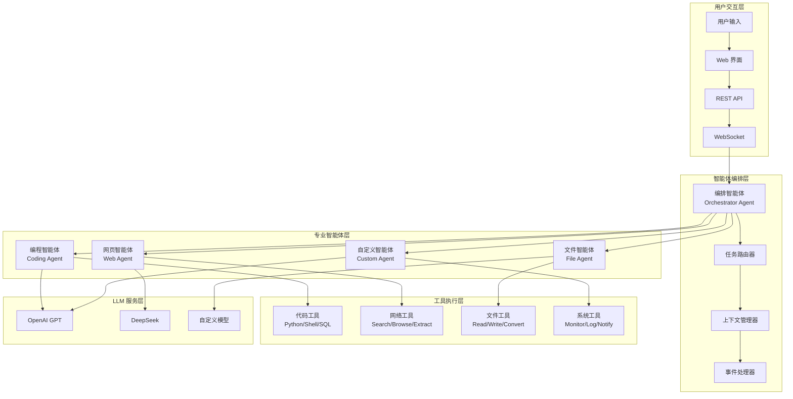
```mermaid
graph TB
    subgraph "用户交互层"
        User[用户输入]
        WebUI[Web 界面]
        API[REST API]
        WS[WebSocket]
    end
    
    subgraph "智能体编排层"
        Orchestrator[编排智能体<br/>Orchestrator Agent]
        Router[任务路由器]
        Context[上下文管理器]
        Events[事件处理器]
    end
    
    subgraph "专业智能体层"
        CodingAgent[编程智能体<br/>Coding Agent]
        WebAgent[网页智能体<br/>Web Agent]
        FileAgent[文件智能体<br/>File Agent]
        CustomAgent[自定义智能体<br/>Custom Agent]
    end
    
    subgraph "工具执行层"
        CodeTools[代码工具<br/>Python/Shell/SQL]
        WebTools[网络工具<br/>Search/Browse/Extract]
        FileTools[文件工具<br/>Read/Write/Convert]
        SystemTools[系统工具<br/>Monitor/Log/Notify]
    end
    
    subgraph "LLM 服务层"
        OpenAI[OpenAI GPT]
        DeepSeek[DeepSeek]
        Custom[自定义模型]
    end
    
    User --> WebUI
    WebUI --> API
    API --> WS
    WS --> Orchestrator
    
    Orchestrator --> Router
    Router --> Context
    Context --> Events
    
    Orchestrator --> CodingAgent
    Orchestrator --> WebAgent
    Orchestrator --> FileAgent
    Orchestrator --> CustomAgent
    
    CodingAgent --> CodeTools
    WebAgent --> WebTools
    FileAgent --> FileTools
    CustomAgent --> SystemTools
    
    CodingAgent --> OpenAI
    WebAgent --> DeepSeek
    FileAgent --> Custom
    CustomAgent --> OpenAI
```

### 4.1.2 智能体分类体系

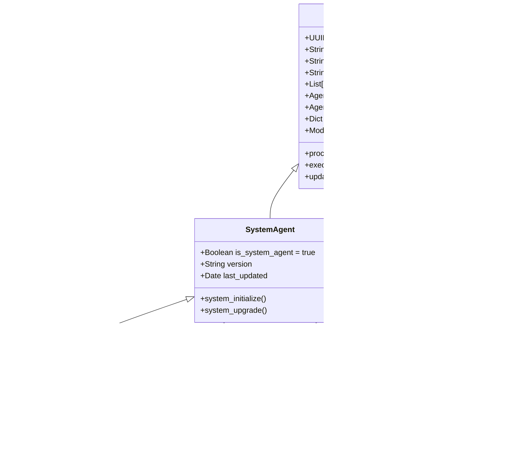
```mermaid
classDiagram
    class Agent {
        +UUID agent_id
        +String name
        +String display_name
        +String instruction
        +List[String] capabilities
        +AgentType agent_type
        +AgentStatus status
        +Dict parameters
        +Model model
        +process_message()
        +execute_tool()
        +update_context()
    }
    
    class SystemAgent {
        +Boolean is_system_agent = true
        +String version
        +Date last_updated
        +system_initialize()
        +system_upgrade()
    }
    
    class CustomAgent {
        +UUID user_id
        +Date created_at
        +Int usage_count
        +Float success_rate
        +user_configure()
        +performance_analytics()
    }
    
    class OrchestratorAgent {
        +task_analysis()
        +agent_selection()
        +task_routing()
        +context_management()
        +result_aggregation()
    }
    
    class CodingAgent {
        +code_generation()
        +code_execution()
        +debugging()
        +testing()
        +documentation()
    }
    
    class WebAgent {
        +web_search()
        +page_browse()
        +content_extract()
        +data_scraping()
        +api_integration()
    }
    
    class FileAgent {
        +file_read()
        +file_write()
        +format_convert()
        +image_process()
        +document_parse()
    }
    
    Agent <|-- SystemAgent
    Agent <|-- CustomAgent
    SystemAgent <|-- OrchestratorAgent
    SystemAgent <|-- CodingAgent
    SystemAgent <|-- WebAgent
    SystemAgent <|-- FileAgent
```

### 4.1.3 智能体生命周期

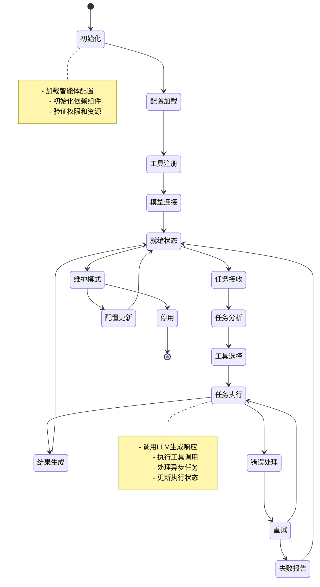
```mermaid
stateDiagram-v2
    [*] --> 初始化
    初始化 --> 配置加载
    配置加载 --> 工具注册
    工具注册 --> 模型连接
    模型连接 --> 就绪状态
    
    就绪状态 --> 任务接收
    任务接收 --> 任务分析
    任务分析 --> 工具选择
    工具选择 --> 任务执行
    任务执行 --> 结果生成
    结果生成 --> 就绪状态
    
    任务执行 --> 错误处理
    错误处理 --> 重试
    重试 --> 任务执行
    重试 --> 失败报告
    失败报告 --> 就绪状态
    
    就绪状态 --> 维护模式
    维护模式 --> 配置更新
    配置更新 --> 就绪状态
    
    维护模式 --> 停用
    停用 --> [*]
    
    note right of 初始化
        - 加载智能体配置
        - 初始化依赖组件
        - 验证权限和资源
    end note
    
    note right of 任务执行
        - 调用LLM生成响应
        - 执行工具调用
        - 处理异步任务
        - 更新执行状态
    end note
```

## 4.2 编排智能体设计

### 4.2.1 编排智能体架构

编排智能体是 ALMA 系统的核心组件，负责任务分析、智能体选择和执行协调：

```python
class OrchestratorAgent:
    """编排智能体实现"""
    
    def __init__(self, config: AgentConfig):
        self.config = config
        self.task_analyzer = TaskAnalyzer()
        self.agent_selector = AgentSelector()
        self.context_manager = ContextManager()
        self.event_handler = EventHandler()
        
    async def process_user_request(
        self, 
        user_message: str, 
        conversation_context: ConversationContext
    ) -> AgentResponse:
        """处理用户请求的主流程"""
        
        # 1. 任务分析
        task_analysis = await self.task_analyzer.analyze(
            user_message, conversation_context
        )
        
        # 2. 智能体选择
        selected_agent = await self.agent_selector.select(
            task_analysis, available_agents=self.get_available_agents()
        )
        
        # 3. 上下文准备
        enhanced_context = await self.context_manager.prepare_context(
            task_analysis, conversation_context, selected_agent
        )
        
        # 4. 任务执行
        if selected_agent == self:
            # 编排智能体直接处理
            response = await self.direct_process(user_message, enhanced_context)
        else:
            # 转发给专业智能体
            response = await self.delegate_to_agent(
                selected_agent, user_message, enhanced_context
            )
        
        # 5. 结果后处理
        final_response = await self.post_process_response(
            response, task_analysis, conversation_context
        )
        
        return final_response
```

### 4.2.2 任务分析算法

```python
class TaskAnalyzer:
    """任务分析器"""
    
    def __init__(self):
        self.task_classifiers = {
            "coding": CodingTaskClassifier(),
            "web": WebTaskClassifier(),
            "file": FileTaskClassifier(),
            "general": GeneralTaskClassifier()
        }
    
    async def analyze(
        self, 
        user_message: str, 
        context: ConversationContext
    ) -> TaskAnalysis:
        """分析用户任务"""
        
        # 提取关键特征
        features = self.extract_features(user_message, context)
        
        # 多分类器投票
        classification_results = {}
        for classifier_name, classifier in self.task_classifiers.items():
            score = await classifier.classify(features)
            classification_results[classifier_name] = score
        
        # 确定主要任务类型
        primary_task_type = max(
            classification_results, 
            key=classification_results.get
        )
        
        # 分析任务复杂度
        complexity = self.analyze_complexity(user_message, context)
        
        # 识别所需工具
        required_tools = self.identify_required_tools(user_message, features)
        
        return TaskAnalysis(
            task_type=primary_task_type,
            confidence=classification_results[primary_task_type],
            complexity=complexity,
            required_tools=required_tools,
            estimated_duration=self.estimate_duration(complexity, required_tools),
            prerequisites=self.check_prerequisites(user_message, context)
        )
    
    def extract_features(
        self, 
        user_message: str, 
        context: ConversationContext
    ) -> TaskFeatures:
        """提取任务特征"""
        
        # 关键词特征
        coding_keywords = ["代码", "编程", "函数", "类", "bug", "调试", "运行"]
        web_keywords = ["搜索", "网页", "下载", "链接", "网站", "API"]
        file_keywords = ["文件", "读取", "保存", "转换", "图片", "文档"]
        
        keyword_scores = {
            "coding": sum(1 for kw in coding_keywords if kw in user_message),
            "web": sum(1 for kw in web_keywords if kw in user_message),
            "file": sum(1 for kw in file_keywords if kw in user_message)
        }
        
        # 实体识别
        entities = self.extract_entities(user_message)
        
        # 上下文特征
        context_features = self.analyze_context(context)
        
        return TaskFeatures(
            keyword_scores=keyword_scores,
            entities=entities,
            context_features=context_features,
            message_length=len(user_message),
            question_type=self.classify_question_type(user_message)
        )
```

### 4.2.3 智能体选择策略

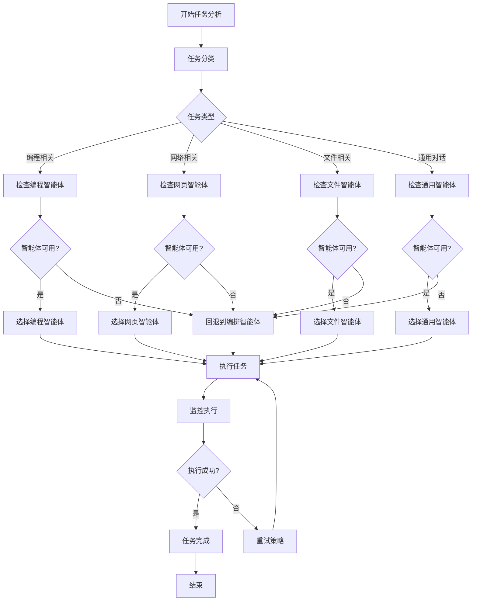
```mermaid
flowchart TD
    Start[开始任务分析] --> Classify[任务分类]
    Classify --> Decision{任务类型}
    
    Decision -->|编程相关| CodingCheck[检查编程智能体]
    Decision -->|网络相关| WebCheck[检查网页智能体]
    Decision -->|文件相关| FileCheck[检查文件智能体]
    Decision -->|通用对话| GeneralCheck[检查通用智能体]
    
    CodingCheck --> CodingAvailable{智能体可用?}
    WebCheck --> WebAvailable{智能体可用?}
    FileCheck --> FileAvailable{智能体可用?}
    GeneralCheck --> GeneralAvailable{智能体可用?}
    
    CodingAvailable -->|是| SelectCoding[选择编程智能体]
    CodingAvailable -->|否| Fallback[回退到编排智能体]
    
    WebAvailable -->|是| SelectWeb[选择网页智能体]
    WebAvailable -->|否| Fallback
    
    FileAvailable -->|是| SelectFile[选择文件智能体]
    FileAvailable -->|否| Fallback
    
    GeneralAvailable -->|是| SelectGeneral[选择通用智能体]
    GeneralAvailable -->|否| Fallback
    
    SelectCoding --> Execute[执行任务]
    SelectWeb --> Execute
    SelectFile --> Execute
    SelectGeneral --> Execute
    Fallback --> Execute
    
    Execute --> Monitor[监控执行]
    Monitor --> Success{执行成功?}
    Success -->|是| Complete[任务完成]
    Success -->|否| Retry[重试策略]
    Retry --> Execute
    
    Complete --> End[结束]
```

## 4.3 专业智能体设计

### 4.3.1 编程智能体 (Coding Agent)

**核心能力**：
```python
class CodingAgent(BaseAgent):
    """编程智能体实现"""
    
    def __init__(self, config: AgentConfig):
        super().__init__(config)
        self.supported_languages = [
            "python", "javascript", "typescript", "shell", "sql", "html", "css"
        ]
        self.tools = {
            "code_executor": CodeExecutor(),
            "file_manager": FileManager(),
            "package_manager": PackageManager(),
            "debugger": Debugger(),
            "tester": CodeTester()
        }
    
    async def process_coding_request(
        self, 
        request: CodingRequest, 
        context: AgentContext
    ) -> CodingResponse:
        """处理编程请求"""
        
        # 分析编程任务类型
        task_type = self.analyze_coding_task(request.user_message)
        
        if task_type == "code_generation":
            return await self.generate_code(request, context)
        elif task_type == "code_execution":
            return await self.execute_code(request, context)
        elif task_type == "debugging":
            return await self.debug_code(request, context)
        elif task_type == "code_review":
            return await self.review_code(request, context)
        else:
            return await self.general_coding_help(request, context)
    
    async def generate_code(
        self, 
        request: CodingRequest, 
        context: AgentContext
    ) -> CodingResponse:
        """生成代码"""
        
        # 构建编程提示
        coding_prompt = self.build_coding_prompt(
            request.user_message,
            context.conversation_history,
            request.language_preference
        )
        
        # 调用 LLM 生成代码
        llm_response = await self.call_llm(coding_prompt, context)
        
        # 提取代码块
        code_blocks = self.extract_code_blocks(llm_response.content)
        
        # 验证代码语法
        validation_results = []
        for code_block in code_blocks:
            validation = await self.tools["debugger"].validate_syntax(code_block)
            validation_results.append(validation)
        
        # 可选：执行代码测试
        if request.auto_execute and all(v.is_valid for v in validation_results):
            execution_results = []
            for code_block in code_blocks:
                if code_block.language in ["python", "javascript"]:
                    result = await self.tools["code_executor"].execute(code_block)
                    execution_results.append(result)
        
        return CodingResponse(
            generated_code=code_blocks,
            validation_results=validation_results,
            execution_results=execution_results if request.auto_execute else None,
            explanation=llm_response.explanation,
            suggestions=self.generate_improvement_suggestions(code_blocks)
        )
    
    async def execute_code(
        self, 
        request: CodingRequest, 
        context: AgentContext
    ) -> CodingResponse:
        """执行代码"""
        
        code_to_execute = request.code or self.extract_code_from_message(
            request.user_message
        )
        
        if not code_to_execute:
            return CodingResponse(
                error="未找到可执行的代码",
                suggestions=["请提供需要执行的代码"]
            )
        
        # 安全检查
        safety_check = await self.tools["debugger"].safety_check(code_to_execute)
        if not safety_check.is_safe:
            return CodingResponse(
                error=f"代码安全检查失败: {safety_check.reason}",
                suggestions=safety_check.suggestions
            )
        
        # 执行代码
        execution_result = await self.tools["code_executor"].execute(
            code_to_execute,
            timeout=request.timeout or 30,
            environment=request.environment or "sandbox"
        )
        
        return CodingResponse(
            execution_result=execution_result,
            output=execution_result.stdout,
            errors=execution_result.stderr,
            explanation=self.explain_execution_result(execution_result)
        )
```

**工具集成**：
```yaml
代码执行工具:
  Python执行器:
    - 沙箱环境执行
    - 包管理支持
    - 依赖安装
    - 虚拟环境隔离
  
  JavaScript执行器:
    - Node.js 运行时
    - npm 包管理
    - ES6+ 语法支持
  
  Shell执行器:
    - 安全命令过滤
    - 权限控制
    - 超时保护

文件管理工具:
  文件操作:
    - 读写文件
    - 目录管理
    - 权限检查
    - 版本控制集成
  
  项目管理:
    - 项目初始化
    - 依赖管理
    - 构建工具集成

调试工具:
  语法检查:
    - 多语言支持
    - 错误定位
    - 修复建议
  
  性能分析:
    - 执行时间统计
    - 内存使用分析
    - 性能优化建议
```

### 4.3.2 网页智能体 (Web Agent)

**核心能力**：
```python
class WebAgent(BaseAgent):
    """网页智能体实现"""
    
    def __init__(self, config: AgentConfig):
        super().__init__(config)
        self.tools = {
            "search_engine": SearchEngine(),
            "web_browser": WebBrowser(),
            "content_extractor": ContentExtractor(),
            "api_client": APIClient(),
            "data_processor": DataProcessor()
        }
    
    async def process_web_request(
        self, 
        request: WebRequest, 
        context: AgentContext
    ) -> WebResponse:
        """处理网络请求"""
        
        task_type = self.analyze_web_task(request.user_message)
        
        if task_type == "search":
            return await self.web_search(request, context)
        elif task_type == "browse":
            return await self.browse_website(request, context)
        elif task_type == "extract":
            return await self.extract_content(request, context)
        elif task_type == "api_call":
            return await self.call_api(request, context)
        else:
            return await self.general_web_help(request, context)
    
    async def web_search(
        self, 
        request: WebRequest, 
        context: AgentContext
    ) -> WebResponse:
        """网络搜索"""
        
        # 提取搜索关键词
        search_query = self.extract_search_query(request.user_message)
        
        # 执行搜索
        search_results = await self.tools["search_engine"].search(
            query=search_query,
            num_results=request.max_results or 10,
            language=request.language or "zh",
            safe_search=True
        )
        
        # 内容摘要
        summarized_results = []
        for result in search_results[:5]:  # 只处理前5个结果
            content = await self.tools["content_extractor"].extract(result.url)
            summary = await self.summarize_content(content, search_query)
            summarized_results.append({
                "title": result.title,
                "url": result.url,
                "summary": summary,
                "relevance_score": result.score
            })
        
        # 生成综合回答
        comprehensive_answer = await self.generate_comprehensive_answer(
            search_query, summarized_results, context
        )
        
        return WebResponse(
            search_results=search_results,
            summarized_results=summarized_results,
            comprehensive_answer=comprehensive_answer,
            sources=self.extract_sources(summarized_results)
        )
```

### 4.3.3 文件智能体 (File Agent)

**核心能力**：
```python
class FileAgent(BaseAgent):
    """文件智能体实现"""
    
    def __init__(self, config: AgentConfig):
        super().__init__(config)
        self.supported_formats = {
            "documents": ["pdf", "docx", "xlsx", "pptx", "txt", "md"],
            "images": ["jpg", "jpeg", "png", "gif", "bmp", "svg"],
            "audio": ["mp3", "wav", "flac", "aac"],
            "video": ["mp4", "avi", "mov", "wmv"],
            "code": ["py", "js", "ts", "html", "css", "sql", "json"]
        }
        self.tools = {
            "file_reader": FileReader(),
            "format_converter": FormatConverter(),
            "image_processor": ImageProcessor(),
            "audio_processor": AudioProcessor(),
            "document_parser": DocumentParser()
        }
    
    async def process_file_request(
        self, 
        request: FileRequest, 
        context: AgentContext
    ) -> FileResponse:
        """处理文件请求"""
        
        task_type = self.analyze_file_task(request.user_message)
        
        if task_type == "read":
            return await self.read_file(request, context)
        elif task_type == "convert":
            return await self.convert_file(request, context)
        elif task_type == "analyze":
            return await self.analyze_file(request, context)
        elif task_type == "generate":
            return await self.generate_file(request, context)
        else:
            return await self.general_file_help(request, context)
    
    async def read_file(
        self, 
        request: FileRequest, 
        context: AgentContext
    ) -> FileResponse:
        """读取文件内容"""
        
        file_path = request.file_path
        file_type = self.detect_file_type(file_path)
        
        # 安全检查
        if not self.is_safe_file(file_path, file_type):
            return FileResponse(
                error="文件类型不安全或路径非法",
                suggestions=["请检查文件路径和类型"]
            )
        
        # 读取文件内容
        try:
            if file_type in self.supported_formats["documents"]:
                content = await self.tools["document_parser"].parse(file_path)
            elif file_type in self.supported_formats["images"]:
                content = await self.tools["image_processor"].analyze(file_path)
            elif file_type in self.supported_formats["audio"]:
                content = await self.tools["audio_processor"].transcribe(file_path)
            else:
                content = await self.tools["file_reader"].read(file_path)
            
            # 生成内容摘要
            summary = await self.summarize_file_content(content, file_type)
            
            return FileResponse(
                file_content=content,
                file_type=file_type,
                summary=summary,
                metadata=self.extract_file_metadata(file_path)
            )
            
        except Exception as e:
            return FileResponse(
                error=f"文件读取失败: {str(e)}",
                suggestions=self.get_troubleshooting_suggestions(file_type)
            )
```

## 4.4 工具系统设计

### 4.4.1 工具架构

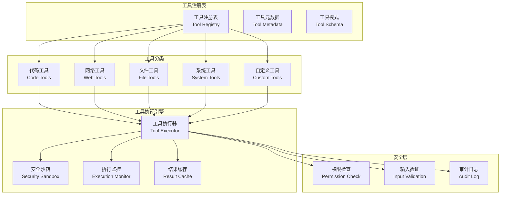
```mermaid
graph TB
    subgraph "工具注册表"
        Registry[工具注册表<br/>Tool Registry]
        Metadata[工具元数据<br/>Tool Metadata]
        Schema[工具模式<br/>Tool Schema]
    end
    
    subgraph "工具分类"
        CodeTools[代码工具<br/>Code Tools]
        WebTools[网络工具<br/>Web Tools]
        FileTools[文件工具<br/>File Tools]
        SystemTools[系统工具<br/>System Tools]
        CustomTools[自定义工具<br/>Custom Tools]
    end
    
    subgraph "工具执行引擎"
        Executor[工具执行器<br/>Tool Executor]
        Sandbox[安全沙箱<br/>Security Sandbox]
        Monitor[执行监控<br/>Execution Monitor]
        Cache[结果缓存<br/>Result Cache]
    end
    
    subgraph "安全层"
        Permission[权限检查<br/>Permission Check]
        Validation[输入验证<br/>Input Validation]
        Audit[审计日志<br/>Audit Log]
    end
    
    Registry --> CodeTools
    Registry --> WebTools
    Registry --> FileTools
    Registry --> SystemTools
    Registry --> CustomTools
    
    CodeTools --> Executor
    WebTools --> Executor
    FileTools --> Executor
    SystemTools --> Executor
    CustomTools --> Executor
    
    Executor --> Sandbox
    Executor --> Monitor
    Executor --> Cache
    
    Executor --> Permission
    Executor --> Validation
    Executor --> Audit
```

### 4.4.2 工具接口标准

```python
from abc import ABC, abstractmethod
from typing import Any, Dict, List, Optional
from pydantic import BaseModel

class ToolSchema(BaseModel):
    """工具模式定义"""
    name: str
    description: str
    parameters: Dict[str, Any]
    required: List[str]
    returns: Dict[str, Any]
    examples: List[Dict[str, Any]]

class ToolResult(BaseModel):
    """工具执行结果"""
    success: bool
    result: Any
    error: Optional[str] = None
    execution_time: float
    metadata: Dict[str, Any] = {}

class BaseTool(ABC):
    """工具基类"""
    
    def __init__(self, config: Dict[str, Any]):
        self.config = config
        self.name = self.__class__.__name__
        self.schema = self.get_schema()
    
    @abstractmethod
    def get_schema(self) -> ToolSchema:
        """获取工具模式"""
        pass
    
    @abstractmethod
    async def execute(self, **kwargs) -> ToolResult:
        """执行工具"""
        pass
    
    def validate_input(self, **kwargs) -> bool:
        """验证输入参数"""
        required_params = self.schema.required
        return all(param in kwargs for param in required_params)
    
    async def pre_execute(self, **kwargs) -> bool:
        """执行前检查"""
        return self.validate_input(**kwargs)
    
    async def post_execute(self, result: ToolResult) -> ToolResult:
        """执行后处理"""
        return result

# 具体工具实现示例
class PythonExecutor(BaseTool):
    """Python 代码执行工具"""
    
    def get_schema(self) -> ToolSchema:
        return ToolSchema(
            name="python_executor",
            description="执行 Python 代码并返回结果",
            parameters={
                "code": {
                    "type": "string",
                    "description": "要执行的 Python 代码"
                },
                "timeout": {
                    "type": "integer",
                    "description": "执行超时时间（秒）",
                    "default": 30
                },
                "environment": {
                    "type": "string",
                    "description": "执行环境",
                    "enum": ["sandbox", "isolated"],
                    "default": "sandbox"
                }
            },
            required=["code"],
            returns={
                "stdout": {"type": "string"},
                "stderr": {"type": "string"},
                "return_code": {"type": "integer"},
                "execution_time": {"type": "number"}
            },
            examples=[
                {
                    "input": {"code": "print('Hello, World!')"},
                    "output": {
                        "stdout": "Hello, World!\n",
                        "stderr": "",
                        "return_code": 0
                    }
                }
            ]
        )
    
    async def execute(self, **kwargs) -> ToolResult:
        """执行 Python 代码"""
        import time
        import subprocess
        import tempfile
        import os
        
        start_time = time.time()
        
        try:
            code = kwargs["code"]
            timeout = kwargs.get("timeout", 30)
            
            # 创建临时文件
            with tempfile.NamedTemporaryFile(
                mode='w', 
                suffix='.py', 
                delete=False
            ) as f:
                f.write(code)
                temp_file = f.name
            
            # 执行代码
            process = subprocess.run(
                ["python", temp_file],
                capture_output=True,
                text=True,
                timeout=timeout
            )
            
            # 清理临时文件
            os.unlink(temp_file)
            
            execution_time = time.time() - start_time
            
            return ToolResult(
                success=process.returncode == 0,
                result={
                    "stdout": process.stdout,
                    "stderr": process.stderr,
                    "return_code": process.returncode,
                    "execution_time": execution_time
                },
                execution_time=execution_time,
                metadata={
                    "tool": "python_executor",
                    "timeout": timeout
                }
            )
            
        except subprocess.TimeoutExpired:
            return ToolResult(
                success=False,
                result=None,
                error="代码执行超时",
                execution_time=time.time() - start_time
            )
        except Exception as e:
            return ToolResult(
                success=False,
                result=None,
                error=f"执行错误: {str(e)}",
                execution_time=time.time() - start_time
            )

class WebSearchTool(BaseTool):
    """网络搜索工具"""
    
    def get_schema(self) -> ToolSchema:
        return ToolSchema(
            name="web_search",
            description="搜索网络信息",
            parameters={
                "query": {
                    "type": "string",
                    "description": "搜索查询"
                },
                "num_results": {
                    "type": "integer",
                    "description": "返回结果数量",
                    "default": 10,
                    "minimum": 1,
                    "maximum": 50
                },
                "language": {
                    "type": "string",
                    "description": "搜索语言",
                    "default": "zh",
                    "enum": ["zh", "en", "auto"]
                }
            },
            required=["query"],
            returns={
                "results": {
                    "type": "array",
                    "items": {
                        "type": "object",
                        "properties": {
                            "title": {"type": "string"},
                            "url": {"type": "string"},
                            "snippet": {"type": "string"},
                            "score": {"type": "number"}
                        }
                    }
                },
                "total_results": {"type": "integer"}
            },
            examples=[
                {
                    "input": {"query": "Python 机器学习"},
                    "output": {
                        "results": [
                            {
                                "title": "Python机器学习入门",
                                "url": "https://example.com",
                                "snippet": "Python机器学习的基础教程...",
                                "score": 0.95
                            }
                        ],
                        "total_results": 1234
                    }
                }
            ]
        )
    
    async def execute(self, **kwargs) -> ToolResult:
        """执行网络搜索"""
        # 这里应该集成实际的搜索API
        # 例如 Google Custom Search API, Bing Search API 等
        
        query = kwargs["query"]
        num_results = kwargs.get("num_results", 10)
        language = kwargs.get("language", "zh")
        
        # 模拟搜索结果
        mock_results = [
            {
                "title": f"关于 {query} 的搜索结果",
                "url": "https://example.com/result1",
                "snippet": f"这是关于 {query} 的详细信息...",
                "score": 0.95
            }
        ]
        
        return ToolResult(
            success=True,
            result={
                "results": mock_results,
                "total_results": len(mock_results)
            },
            execution_time=0.5,
            metadata={
                "tool": "web_search",
                "query": query,
                "language": language
            }
        )
```

### 4.4.3 工具安全机制

```python
class ToolSecurityManager:
    """工具安全管理器"""
    
    def __init__(self):
        self.dangerous_commands = {
            "shell": ["rm", "del", "format", "shutdown", "reboot"],
            "python": ["os.system", "subprocess.call", "exec", "eval"],
            "javascript": ["eval", "Function", "require('child_process')"]
        }
        
        self.permission_levels = {
            "read_only": ["file_read", "web_search", "content_extract"],
            "safe_execute": ["python_executor", "math_calculator"],
            "privileged": ["shell_executor", "file_write", "system_command"]
        }
    
    async def check_permission(
        self, 
        tool_name: str, 
        user: User, 
        context: AgentContext
    ) -> bool:
        """检查工具使用权限"""
        
        # 获取工具权限级别
        permission_level = self.get_tool_permission_level(tool_name)
        
        # 检查用户权限
        if permission_level == "privileged" and not user.is_superuser:
            return False
        
        # 检查上下文限制
        if context.restricted_mode and permission_level != "read_only":
            return False
        
        return True
    
    async def validate_tool_input(
        self, 
        tool_name: str, 
        input_data: Dict[str, Any]
    ) -> bool:
        """验证工具输入"""
        
        if tool_name == "shell_executor":
            command = input_data.get("command", "")
            return not any(
                dangerous in command.lower() 
                for dangerous in self.dangerous_commands["shell"]
            )
        
        elif tool_name == "python_executor":
            code = input_data.get("code", "")
            return not any(
                dangerous in code 
                for dangerous in self.dangerous_commands["python"]
            )
        
        return True
    
    def get_tool_permission_level(self, tool_name: str) -> str:
        """获取工具权限级别"""
        for level, tools in self.permission_levels.items():
            if tool_name in tools:
                return level
        return "safe_execute"  # 默认安全级别
```

## 4.5 任务调度机制

### 4.5.1 调度器架构

```python
class TaskScheduler:
    """任务调度器"""
    
    def __init__(self):
        self.task_queue = asyncio.Queue()
        self.agent_pool = AgentPool()
        self.execution_monitor = ExecutionMonitor()
        self.context_manager = ContextManager()
        
    async def schedule_task(self, task: AgentTask) -> str:
        """调度任务"""
        
        # 生成任务ID
        task_id = str(uuid.uuid4())
        task.task_id = task_id
        
        # 任务优先级排序
        priority = self.calculate_priority(task)
        task.priority = priority
        
        # 添加到队列
        await self.task_queue.put((priority, task))
        
        # 启动执行
        asyncio.create_task(self.execute_task(task))
        
        return task_id
    
    async def execute_task(self, task: AgentTask):
        """执行任务"""
        
        try:
            # 分配智能体
            agent = await self.agent_pool.allocate_agent(task)
            
            # 准备执行上下文
            context = await self.context_manager.prepare_context(task)
            
            # 执行任务
            result = await agent.execute(task, context)
            
            # 更新任务状态
            task.status = "completed"
            task.result = result
            
            # 释放智能体
            await self.agent_pool.release_agent(agent)
            
        except Exception as e:
            task.status = "failed"
            task.error = str(e)
            
            # 错误处理和重试逻辑
            if task.retry_count < task.max_retries:
                task.retry_count += 1
                await asyncio.sleep(2 ** task.retry_count)  # 指数退避
                await self.task_queue.put((task.priority, task))
    
    def calculate_priority(self, task: AgentTask) -> int:
        """计算任务优先级"""
        
        base_priority = 5  # 基础优先级
        
        # 用户级别调整
        if task.user.is_superuser:
            base_priority += 3
        
        # 任务类型调整
        if task.task_type == "interactive":
            base_priority += 2  # 交互任务优先级更高
        
        # 紧急程度调整
        if task.urgency == "high":
            base_priority += 2
        elif task.urgency == "low":
            base_priority -= 1
        
        return base_priority
```

### 4.5.2 智能体池管理

```python
class AgentPool:
    """智能体池管理"""
    
    def __init__(self, max_agents: int = 10):
        self.max_agents = max_agents
        self.available_agents: Dict[str, List[Agent]] = {}
        self.busy_agents: Dict[str, Agent] = {}
        self.agent_stats: Dict[str, AgentStats] = {}
        
    async def allocate_agent(self, task: AgentTask) -> Agent:
        """分配智能体"""
        
        agent_type = task.required_agent_type
        
        # 查找可用智能体
        if agent_type in self.available_agents and self.available_agents[agent_type]:
            agent = self.available_agents[agent_type].pop()
        else:
            # 创建新智能体
            agent = await self.create_agent(agent_type)
        
        # 标记为忙碌
        self.busy_agents[agent.agent_id] = agent
        
        # 更新统计
        self.update_agent_stats(agent, "allocated")
        
        return agent
    
    async def release_agent(self, agent: Agent):
        """释放智能体"""
        
        # 从忙碌列表移除
        if agent.agent_id in self.busy_agents:
            del self.busy_agents[agent.agent_id]
        
        # 添加到可用列表
        agent_type = agent.agent_type
        if agent_type not in self.available_agents:
            self.available_agents[agent_type] = []
        
        self.available_agents[agent_type].append(agent)
        
        # 更新统计
        self.update_agent_stats(agent, "released")
    
    async def create_agent(self, agent_type: str) -> Agent:
        """创建新智能体"""
        
        if len(self.busy_agents) >= self.max_agents:
            raise Exception("智能体池已满，无法创建新智能体")
        
        # 根据类型创建对应智能体
        if agent_type == "coding":
            return CodingAgent(self.get_agent_config("coding"))
        elif agent_type == "web":
            return WebAgent(self.get_agent_config("web"))
        elif agent_type == "file":
            return FileAgent(self.get_agent_config("file"))
        else:
            return OrchestratorAgent(self.get_agent_config("orchestrator"))
    
    def get_pool_stats(self) -> Dict[str, Any]:
        """获取池统计信息"""
        
        total_available = sum(len(agents) for agents in self.available_agents.values())
        total_busy = len(self.busy_agents)
        
        return {
            "total_agents": total_available + total_busy,
            "available_agents": total_available,
            "busy_agents": total_busy,
            "utilization_rate": total_busy / (total_available + total_busy) if (total_available + total_busy) > 0 else 0,
            "agent_breakdown": {
                agent_type: len(agents) 
                for agent_type, agents in self.available_agents.items()
            }
        }
```

## 4.6 上下文管理

### 4.6.1 上下文架构

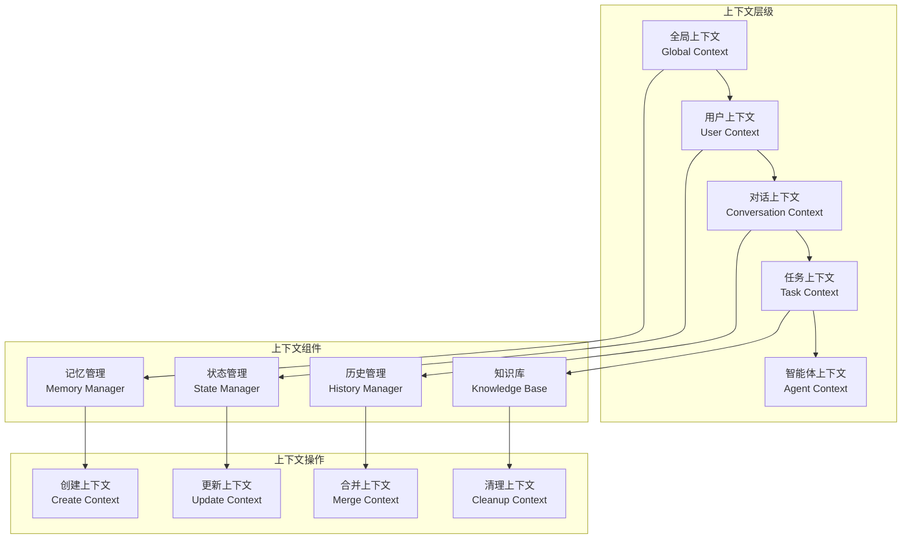
```mermaid
graph TB
    subgraph "上下文层级"
        Global[全局上下文<br/>Global Context]
        User[用户上下文<br/>User Context]
        Conversation[对话上下文<br/>Conversation Context]
        Task[任务上下文<br/>Task Context]
        Agent[智能体上下文<br/>Agent Context]
    end
    
    subgraph "上下文组件"
        Memory[记忆管理<br/>Memory Manager]
        State[状态管理<br/>State Manager]
        History[历史管理<br/>History Manager]
        Knowledge[知识库<br/>Knowledge Base]
    end
    
    subgraph "上下文操作"
        Create[创建上下文<br/>Create Context]
        Update[更新上下文<br/>Update Context]
        Merge[合并上下文<br/>Merge Context]
        Cleanup[清理上下文<br/>Cleanup Context]
    end
    
    Global --> User
    User --> Conversation
    Conversation --> Task
    Task --> Agent
    
    Global --> Memory
    User --> State
    Conversation --> History
    Task --> Knowledge
    
    Memory --> Create
    State --> Update
    History --> Merge
    Knowledge --> Cleanup
```

### 4.6.2 上下文管理实现

```python
class ContextManager:
    """上下文管理器"""
    
    def __init__(self):
        self.global_context = GlobalContext()
        self.user_contexts: Dict[str, UserContext] = {}
        self.conversation_contexts: Dict[str, ConversationContext] = {}
        self.context_store = ContextStore()
        
    async def get_context(
        self, 
        user_id: str, 
        conversation_id: str, 
        task_id: Optional[str] = None
    ) -> AgentContext:
        """获取完整上下文"""
        
        # 获取用户上下文
        user_context = await self.get_user_context(user_id)
        
        # 获取对话上下文
        conversation_context = await self.get_conversation_context(
            conversation_id, user_id
        )
        
        # 合并上下文
        merged_context = AgentContext(
            global_context=self.global_context,
            user_context=user_context,
            conversation_context=conversation_context,
            task_id=task_id
        )
        
        return merged_context
    
    async def update_context(
        self, 
        context: AgentContext, 
        update_data: Dict[str, Any]
    ):
        """更新上下文"""
        
        # 更新对话上下文
        if "conversation" in update_data:
            context.conversation_context.update(update_data["conversation"])
        
        # 更新用户上下文
        if "user" in update_data:
            context.user_context.update(update_data["user"])
        
        # 持久化更新
        await self.context_store.save_context(context)
    
    async def cleanup_expired_contexts(self):
        """清理过期上下文"""
        
        current_time = datetime.utcnow()
        expired_conversations = []
        
        for conv_id, context in self.conversation_contexts.items():
            if (current_time - context.last_activity).total_seconds() > 3600:  # 1小时超时
                expired_conversations.append(conv_id)
        
        for conv_id in expired_conversations:
            await self.context_store.archive_context(conv_id)
            del self.conversation_contexts[conv_id]

class ConversationContext:
    """对话上下文"""
    
    def __init__(self, conversation_id: str, user_id: str):
        self.conversation_id = conversation_id
        self.user_id = user_id
        self.messages: List[Message] = []
        self.active_agents: List[str] = []
        self.context_variables: Dict[str, Any] = {}
        self.last_activity = datetime.utcnow()
        
    def add_message(self, message: Message):
        """添加消息"""
        self.messages.append(message)
        self.last_activity = datetime.utcnow()
        
        # 维护上下文窗口大小
        if len(self.messages) > 50:  # 保留最近50条消息
            self.messages = self.messages[-50:]
    
    def get_recent_messages(self, count: int = 10) -> List[Message]:
        """获取最近消息"""
        return self.messages[-count:] if len(self.messages) >= count else self.messages
    
    def set_variable(self, key: str, value: Any):
        """设置上下文变量"""
        self.context_variables[key] = value
        self.last_activity = datetime.utcnow()
    
    def get_variable(self, key: str, default: Any = None) -> Any:
        """获取上下文变量"""
        return self.context_variables.get(key, default)
```

---

通过以上智能体系统设计，ALMA 确保了：
- **智能协作**: 多智能体协同工作，各司其职
- **任务适配**: 根据任务类型自动选择最适合的智能体
- **工具丰富**: 标准化的工具接口，支持各种专业工具
- **安全可控**: 完善的权限控制和安全检查机制
- **高效调度**: 智能的任务调度和资源管理
- **上下文感知**: 完整的上下文管理，保持对话连贯性

---

# 5. 对话系统设计

*🚧 本章节待补充...*

---

# 6. 前端界面设计

*🚧 本章节待补充...*

---

# 7. 后端服务设计

*🚧 本章节待补充...*

---

# 8. 安全设计

*🚧 本章节待补充...*

---

# 9. 性能优化设计

*🚧 本章节待补充...*

---

# 10. 部署运维设计

*🚧 本章节待补充...*

---

# 11. 测试设计

*🚧 本章节待补充...*

---

# 12. 扩展性设计

*🚧 本章节待补充...*

---

## 📞 联系方式

**项目团队**：
- 产品负责人：[姓名] <email@example.com>
- 技术负责人：[姓名] <email@example.com>
- 架构师：[姓名] <email@example.com>

**文档维护**：
- 本文档由技术团队负责维护
- 重大设计变更需经过架构评审
- 定期更新以反映最新设计
