# ALMA 系统需求文档

**A**lternating **L**ightweight **M**ulti-**A**gent - 轻量级多智能体协作平台

---

## 📋 文档信息

| 项目信息 | 详情 |
|---------|------|
| **项目名称** | ALMA (Alternating Lightweight Multi-Agent) |
| **项目类型** | 轻量级多智能体协作平台 |
| **目标用户** | 个人开发者、小团队、研究人员 |
| **版本** | v1.0 |
| **文档版本** | v1.0 |
| **创建日期** | 2025-06-24 |
| **更新日期** | 2025-06-24 |

---

## 🎯 1. 项目概述

### 1.1 项目背景

在人工智能快速发展的今天，大型多智能体系统（如 Manus）虽然功能强大，但对于个人开发者和小团队来说往往过于复杂和重量级。市场迫切需要一个轻量级、易部署、易使用的多智能体协作平台。

ALMA 应运而生，定位为 Manus 的轻量级替代方案，专注于核心功能的实现，降低使用门槛，提供开箱即用的智能体协作体验。

### 1.2 产品定位

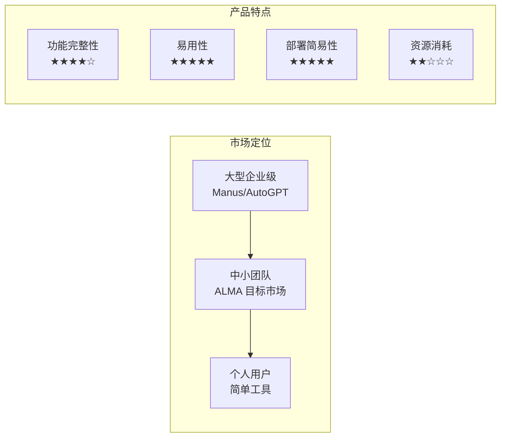

**核心定位**：
- **轻量级**：相比 Manus 减少 80% 的复杂性，保留核心 20% 的功能
- **易部署**：Docker Compose 一键部署，5分钟内完成环境搭建
- **开箱即用**：预配置 4 个核心智能体，满足 90% 常见使用场景
- **成本友好**：支持多种 LLM 提供商，用户可选择性价比最高的方案

### 1.3 目标用户画像

#### 主要用户群体

1. **个人开发者** (40%)
   - 需要 AI 辅助编程和问题解决
   - 对复杂系统配置缺乏时间和精力
   - 希望快速体验多智能体协作

2. **小型创业团队** (35%)
   - 3-10 人规模，资源有限
   - 需要 AI 提升工作效率
   - 预算敏感，希望控制 AI 使用成本

3. **研究人员/学生** (20%)
   - 学术研究或课程项目需要
   - 需要理解多智能体系统原理
   - 希望在研究基础上进行二次开发

4. **企业技术评估** (5%)
   - 大企业的技术调研团队
   - 在引入大型系统前进行概念验证
   - 需要快速搭建原型系统

#### 用户需求层次

```mermaid
pyramid
    title 用户需求金字塔
    "高级需求" : "定制化开发<br/>系统集成<br/>性能优化"
    "进阶需求" : "多场景应用<br/>工作流自动化<br/>团队协作"
    "核心需求" : "智能对话<br/>任务执行<br/>历史记录"
    "基础需求" : "系统可用<br/>配置简单<br/>响应及时"
```

---

## 🚀 2. 功能需求

### 2.1 核心功能模块

#### 2.1.1 用户管理模块

**基础功能**：
- [x] 用户注册/登录
- [x] 密码管理（修改密码、找回密码）
- [x] 个人信息管理
- [x] 会话管理（JWT 认证）

**进阶功能**：
- [ ] OAuth 第三方登录（GitHub、Google）
- [ ] 用户偏好设置
- [ ] 使用统计和报告

**管理员功能**：
- [x] 用户管理（查看、禁用）
- [ ] 系统监控
- [ ] 日志查看

#### 2.1.2 LLM 配置模块

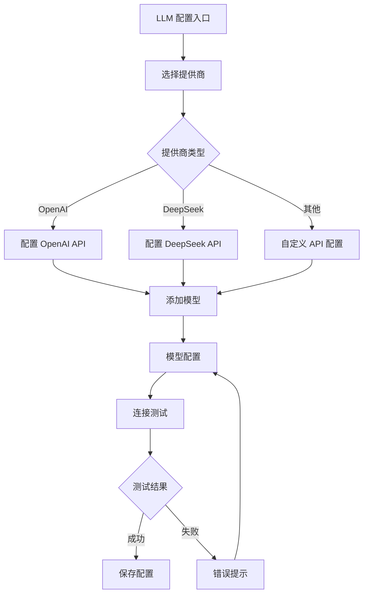

**核心需求**：
- [x] **多提供商支持**
  - OpenAI (GPT-3.5, GPT-4, GPT-4o)
  - DeepSeek (deepseek-chat, deepseek-reasoner)
  - 兼容 OpenAI API 的其他提供商
- [x] **安全存储**：API 密钥加密存储
- [x] **模型管理**：每个 LLM 下配置多个模型
- [x] **连接验证**：配置后自动测试可用性

**扩展需求**：
- [ ] **成本控制**：设置每日/月使用限额
- [ ] **智能路由**：根据任务类型自动选择最优模型
- [ ] **降级策略**：主服务不可用时自动切换备用

#### 2.1.3 智能体管理模块

**系统预置智能体**：

1. **编排智能体 (Orchestrator Agent)**
   ```yaml
   名称: "任务编排师"
   职责: "任务分析、智能体调度、进度管理"
   核心能力:
     - 复杂任务分解
     - 智能体选择和路由
     - 任务状态跟踪
     - 上下文管理
   ```

2. **编程智能体 (Coding Agent)**
   ```yaml
   名称: "代码工程师"
   职责: "代码编写、程序执行、项目开发"
   工具集:
     - 文件操作 (创建、读取、编辑)
     - 代码执行 (Python, Shell)
     - 项目管理 (依赖安装、构建)
     - 调试工具 (错误分析、日志查看)
   支持语言: [Python, JavaScript, TypeScript, Shell, SQL, HTML/CSS]
   ```

3. **网页智能体 (Web Agent)**
   ```yaml
   名称: "网络助手"
   职责: "信息搜索、网页操作、内容抓取"
   工具集:
     - 搜索引擎 (Google, Bing)
     - 网页操作 (点击、输入、导航)
     - 内容提取 (文本、图片、链接)
     - 页面分析 (结构解析、数据提取)
   ```

4. **文件智能体 (Local File Agent)**
   ```yaml
   名称: "文档专家"
   职责: "文件处理、格式转换、内容分析"
   支持格式:
     - 文档: PDF, DOCX, XLSX, PPTX, TXT, MD
     - 媒体: 图片 (JPG, PNG), 音频 (MP3, WAV)
     - 代码: 各种编程语言源文件
   核心功能:
     - 文档内容提取和分析
     - 格式转换和处理
     - 图像识别和描述
     - 音频转文字
   ```

**智能体功能需求**：
- [x] **查看智能体**：显示所有可用的系统智能体
- [x] **智能体详情**：查看智能体的能力、工具、状态
- [ ] **使用统计**：每个智能体的调用次数、成功率
- [ ] **性能监控**：响应时间、错误率统计

**未来扩展**：
- [ ] **自定义智能体**：用户创建个人智能体
- [ ] **智能体市场**：共享和下载社区智能体
- [ ] **智能体编排**：可视化工作流设计

#### 2.1.4 对话交互模块

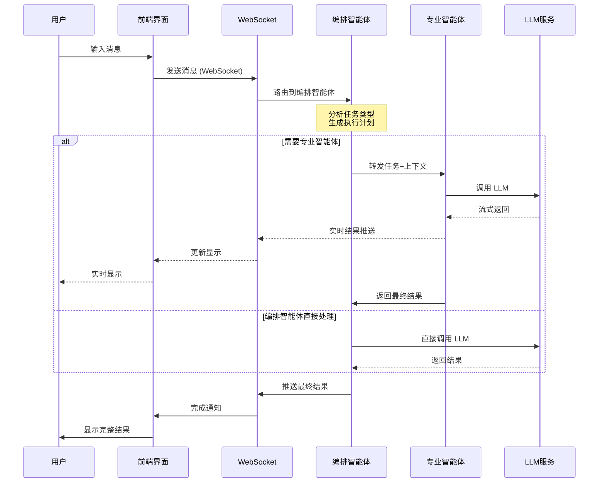

**核心功能**：
- [x] **实时通信**：WebSocket 支持实时双向通信
- [x] **流式响应**：支持大型任务的实时进度反馈
- [x] **多角色显示**：用户、助手、系统、工具消息的差异化展示
- [x] **对话历史**：完整保存和管理对话记录
- [x] **上下文维护**：智能体间上下文传递和状态管理

**交互特性**：
- [x] **智能路由**：根据用户输入自动选择合适的智能体
- [x] **任务分解**：复杂请求自动分解为子任务
- [x] **进度跟踪**：多步骤任务的执行进度可视化
- [x] **错误处理**：优雅的错误提示和恢复机制

**用户体验**：
- [ ] **消息搜索**：在历史对话中搜索特定内容
- [ ] **对话导出**：支持导出对话记录 (MD, PDF)
- [ ] **快捷操作**：常用指令的快捷按钮
- [ ] **语音输入**：支持语音转文字输入

#### 2.1.5 对话管理模块

**侧边栏功能**：
- [x] **对话列表**：显示用户的所有对话记录
- [x] **对话搜索**：根据标题或内容搜索对话
- [x] **对话操作**：重命名、删除、固定对话
- [x] **新建对话**：快速创建新的对话会话

**对话组织**：
- [ ] **对话分类**：按项目、主题分组管理
- [ ] **标签系统**：为对话添加自定义标签
- [ ] **收藏功能**：标记重要对话便于快速访问
- [ ] **批量操作**：批量删除、导出、分类

### 2.2 系统级功能需求

#### 2.2.1 任务调度系统

**智能体协作机制**：

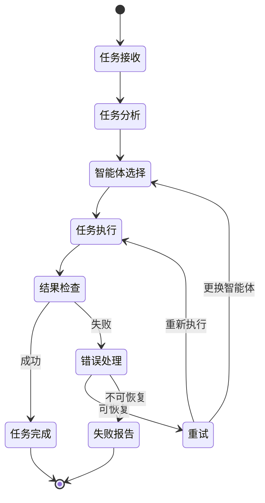

**核心需求**：
- [x] **任务分解**：将复杂任务分解为可执行的子任务
- [x] **智能路由**：根据任务类型选择最适合的智能体
- [x] **状态管理**：维护任务执行状态和上下文
- [x] **错误恢复**：智能体失败时的回退和重试机制

**调度策略**：
- [x] **优先级调度**：用户交互任务优先级最高
- [ ] **负载均衡**：多智能体并行处理非依赖任务
- [ ] **资源管控**：限制单用户并发任务数量
- [ ] **超时控制**：长时间任务的超时和中断机制

#### 2.2.2 安全与权限

**身份认证**：
- [x] JWT 无状态认证
- [x] 密码强度验证
- [x] 会话过期管理
- [ ] 双因素认证 (2FA)

**数据安全**：
- [x] API 密钥加密存储
- [x] 数据库连接加密
- [x] 用户数据隔离
- [ ] 数据备份和恢复

**访问控制**：
- [x] 基于角色的权限控制 (RBAC)
- [x] API 接口权限验证
- [ ] 细粒度资源权限
- [ ] 审计日志记录

#### 2.2.3 监控与日志

**系统监控**：
- [ ] **性能指标**：响应时间、吞吐量、错误率
- [ ] **资源监控**：CPU、内存、磁盘、网络使用率
- [ ] **服务健康**：各组件状态检查和告警

**业务监控**：
- [ ] **用户活跃度**：在线用户数、活跃会话数
- [ ] **功能使用**：各智能体调用统计
- [ ] **成本分析**：LLM API 调用费用统计

**日志管理**：
- [x] **结构化日志**：JSON 格式的应用日志
- [ ] **日志聚合**：集中式日志收集和检索
- [ ] **日志分析**：错误模式识别和告警

---

## 🎨 3. 非功能性需求

### 3.1 性能需求

#### 3.1.1 响应时间

| 操作类型 | 期望响应时间 | 最大可接受时间 | 备注 |
|---------|-------------|---------------|------|
| 用户登录 | < 1s | < 3s | 包含 JWT 生成 |
| 页面加载 | < 2s | < 5s | 首屏渲染完成 |
| 消息发送 | < 500ms | < 1s | WebSocket 响应 |
| 智能体响应 | < 3s | < 10s | 首次响应时间 |
| 文件上传 | < 5s | < 15s | 10MB 以内文件 |
| 配置保存 | < 1s | < 3s | LLM 配置更新 |

#### 3.1.2 并发能力

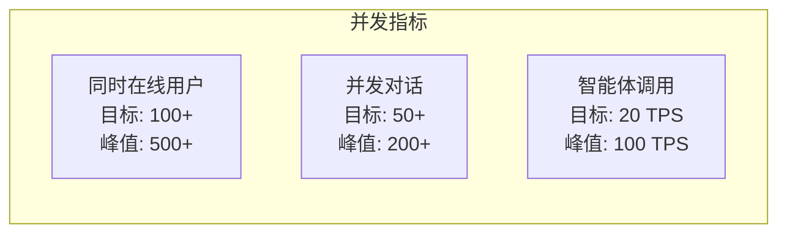

**具体指标**：
- **同时在线用户**：支持 100+ 并发用户，峰值 500+
- **并发对话**：支持 50+ 并发对话会话
- **API 吞吐量**：20+ TPS 正常负载，100+ TPS 峰值
- **WebSocket 连接**：单服务器 1000+ 并发连接

#### 3.1.3 可用性

- **系统可用性**：99.5% (每月停机 < 3.6 小时)
- **服务恢复**：故障后 5 分钟内自动恢复
- **数据一致性**：99.99% 数据完整性保证
- **降级服务**：核心功能在部分故障时仍可用

### 3.2 可扩展性需求

#### 3.2.1 水平扩展

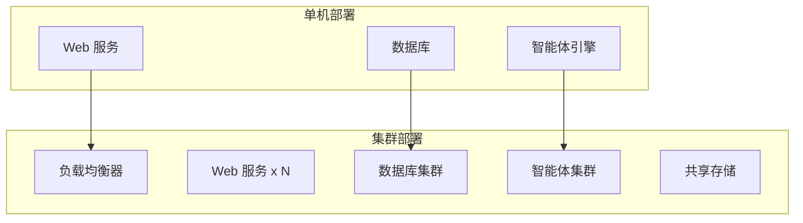

**扩展路径**：
1. **阶段一**：单机部署 (Docker Compose)
2. **阶段二**：容器编排 (Kubernetes)
3. **阶段三**：微服务架构
4. **阶段四**：云原生部署

#### 3.2.2 功能扩展

**智能体扩展**：
- [ ] 插件式智能体架构
- [ ] 动态加载和卸载
- [ ] 第三方智能体接入

**工具生态**：
- [ ] 标准化工具接口
- [ ] 工具市场和共享
- [ ] 自定义工具开发

### 3.3 兼容性需求

#### 3.3.1 浏览器兼容

| 浏览器 | 最低版本 | 备注 |
|--------|---------|------|
| Chrome | 90+ | 主要测试目标 |
| Firefox | 88+ | 完整功能支持 |
| Safari | 14+ | macOS 用户 |
| Edge | 90+ | Windows 用户 |

#### 3.3.2 操作系统兼容

**部署平台**：
- [x] Linux (Ubuntu 20.04+, CentOS 8+)
- [x] macOS (Intel + Apple Silicon)
- [x] Windows (WSL2 环境)

**开发环境**：
- [x] 支持主流 IDE (VS Code, PyCharm, WebStorm)
- [x] 容器化开发环境
- [x] 热重载和调试支持

### 3.4 安全需求

#### 3.4.1 数据安全

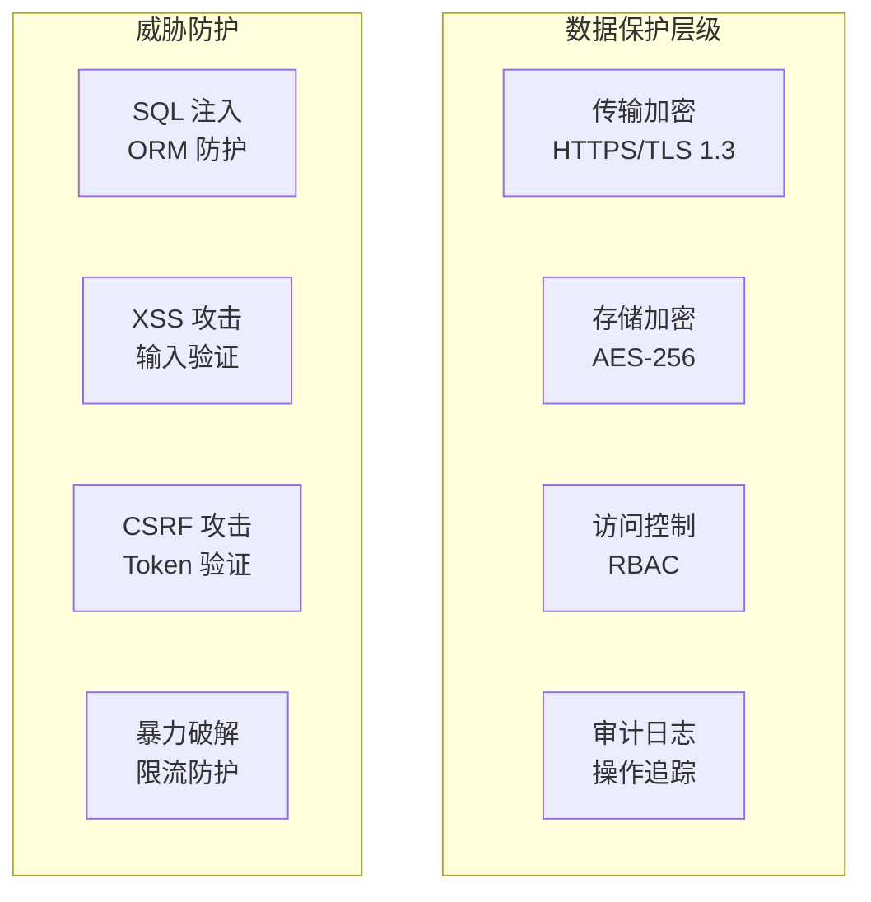

**安全措施**：
- [x] **传输安全**：HTTPS 强制，TLS 1.3 加密
- [x] **存储安全**：敏感数据 AES-256 加密
- [x] **访问安全**：JWT 认证 + RBAC 授权
- [ ] **防护机制**：Rate Limiting、Input Validation

#### 3.4.2 隐私保护

- [x] **数据最小化**：只收集必要信息
- [x] **用户控制**：用户可删除自己的数据
- [ ] **匿名化处理**：统计数据去标识化
- [ ] **合规性**：GDPR 等隐私法规遵循

---

## 💻 4. 技术需求

### 4.1 架构需求

#### 4.1.1 总体架构

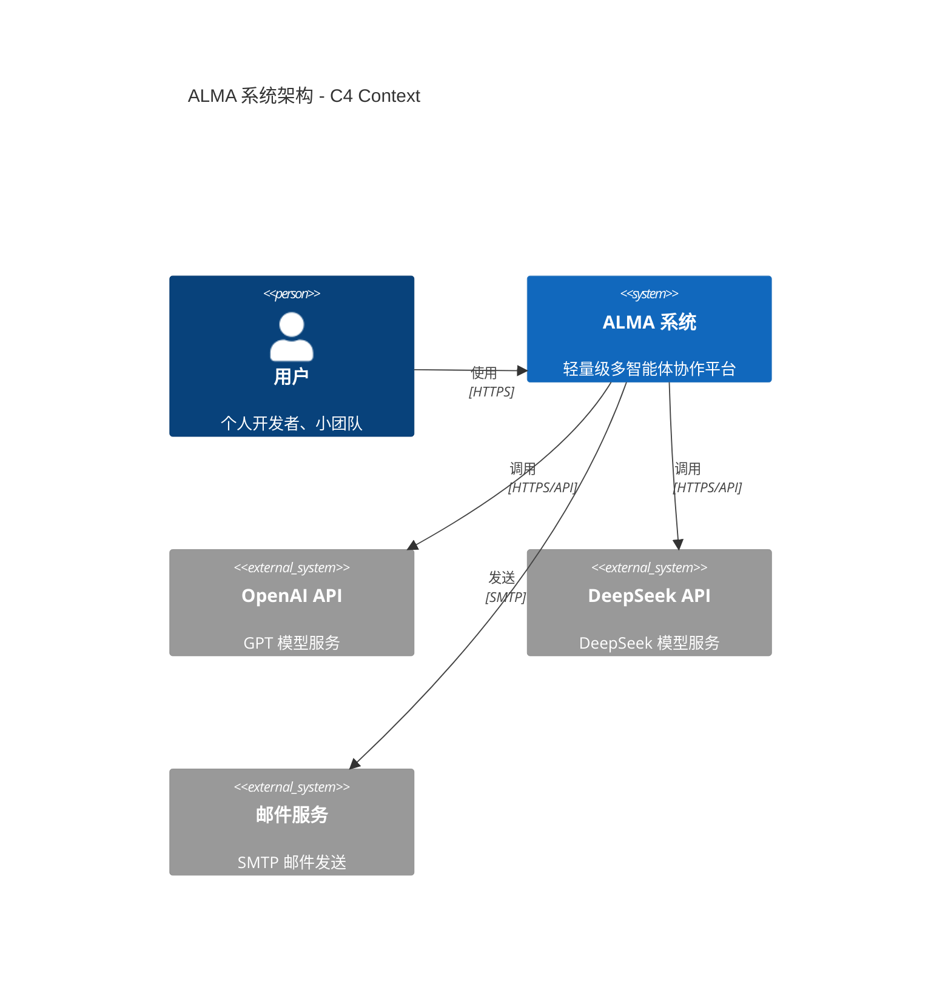

**架构原则**：
- **分层架构**：表现层、业务层、数据层清晰分离
- **模块化设计**：高内聚、低耦合的模块结构
- **API 优先**：前后端通过 RESTful API + WebSocket 通信
- **容器化部署**：Docker 容器化，便于部署和扩展

#### 4.1.2 技术栈选择

**前端技术栈**：
```typescript
// 核心框架
React 18.2           // UI 框架
TypeScript 5.2+      // 类型安全
Vite 6.3+           // 构建工具

// UI 和状态管理
Chakra UI 3.8+      // 组件库
TanStack Router     // 路由管理
React Query 5.28+   // 状态管理
Zustand             // 轻量状态库

// 工具链
Biome 1.9+          // 代码规范
Axios 1.9           // HTTP 客户端
```

**后端技术栈**：
```python
# 核心框架
FastAPI 0.114+      # Web 框架
SQLModel 0.0.21+    # ORM
Pydantic 2.0+       # 数据验证

# 数据库和缓存
PostgreSQL 17       # 主数据库
Redis 7.0+          # 缓存和会话

# 智能体框架
AutoAgent           # 自研框架
OpenAI 1.40+        # LLM 客户端

# 部署和监控
Docker              # 容器化
Traefik             # 反向代理
Prometheus          # 监控
```

### 4.2 开发需求

#### 4.2.1 开发环境

**必要工具**：
- Docker Desktop 20.10+
- Node.js 18+ / Python 3.10+
- VS Code / PyCharm / WebStorm
- Git 2.30+

**推荐配置**：
- CPU: 8核心以上
- 内存: 16GB 以上
- 存储: SSD 256GB 以上
- 网络: 稳定的互联网连接

#### 4.2.2 开发规范

**代码规范**：
```yaml
前端规范:
  - ESLint + Prettier 代码格式化
  - TypeScript 严格模式
  - 组件单一职责原则
  - Hooks 使用最佳实践

后端规范:
  - Black + isort 代码格式化
  - mypy 类型检查
  - FastAPI 最佳实践
  - SQLModel 数据建模
```

**测试要求**：
- 单元测试覆盖率 > 80%
- 集成测试覆盖核心功能
- E2E 测试覆盖主要用户流程
- 性能测试验证关键指标

#### 4.2.3 CI/CD 流程


**流程要求**：
- 自动化构建和测试
- 代码质量门禁
- 安全漏洞扫描
- 蓝绿部署策略

### 4.3 部署需求

#### 4.3.1 最小部署配置

**硬件要求**：
```yaml
最小配置:
  CPU: 2 核心
  内存: 4GB
  存储: 50GB
  网络: 100Mbps

推荐配置:
  CPU: 4 核心
  内存: 8GB
  存储: 100GB SSD
  网络: 1Gbps
```

**软件要求**：
```yaml
操作系统:
  - Ubuntu 20.04+ LTS
  - CentOS 8+
  - Docker 20.10+
  - Docker Compose 2.0+

网络要求:
  - 公网 IP 或域名
  - HTTPS 证书支持
  - 端口开放: 80, 443
```

#### 4.3.2 部署方式

**单机部署** (默认方式)：
```bash
# 克隆代码
git clone <repo-url>
cd alma

# 配置环境变量
cp .env.example .env
vim .env

# 启动服务
docker-compose up -d
```

**集群部署** (扩展方式)：
```yaml
# Kubernetes 部署示例
apiVersion: apps/v1
kind: Deployment
metadata:
  name: alma-backend
spec:
  replicas: 3
  selector:
    matchLabels:
      app: alma-backend
  template:
    metadata:
      labels:
        app: alma-backend
    spec:
      containers:
      - name: backend
        image: alma-backend:latest
        ports:
        - containerPort: 8000
```

---

## 🧪 5. 测试需求

### 5.1 测试策略

#### 5.1.1 测试金字塔

```mermaid
pyramid
    title 测试策略金字塔
    "E2E 测试" : "用户场景<br/>浏览器自动化<br/>集成验证"
    "集成测试" : "API 测试<br/>数据库测试<br/>智能体协作"
    "单元测试" : "函数测试<br/>组件测试<br/>业务逻辑"
```

**测试比例**：
- 单元测试: 70%
- 集成测试: 20%
- E2E 测试: 10%

#### 5.1.2 测试类型

**功能测试**：
- [x] 用户注册/登录流程
- [x] LLM 配置和验证
- [x] 智能体对话交互
- [x] 文件上传和处理
- [ ] 多用户并发场景

**性能测试**：
- [ ] 响应时间测试
- [ ] 并发用户测试
- [ ] 长时间运行测试
- [ ] 资源使用监控

**安全测试**：
- [ ] 身份认证测试
- [ ] 权限控制测试
- [ ] 输入验证测试
- [ ] SQL 注入测试

**兼容性测试**：
- [ ] 多浏览器测试
- [ ] 移动端适配测试
- [ ] 不同操作系统测试

### 5.2 测试用例

#### 5.2.1 核心用户流程

**流程 1：用户注册到首次对话**
```gherkin
Feature: 用户首次使用流程
  Scenario: 新用户完整体验
    Given 用户访问 ALMA 首页
    When 用户点击注册按钮
    And 用户填写邮箱和密码
    And 用户验证邮箱
    And 用户登录系统
    And 用户配置第一个 LLM (OpenAI)
    And 用户添加模型 (GPT-4)
    And 用户发送第一条消息 "你好"
    Then 系统应该返回智能体回复
    And 对话记录保存在侧边栏
```

**流程 2：复杂任务执行**
```gherkin
Feature: 多智能体协作任务
  Scenario: 代码编写和执行
    Given 用户已登录系统
    And 用户已配置 LLM
    When 用户发送消息 "写一个 Python 脚本计算斐波那契数列"
    Then 编排智能体分析任务
    And 转发给编程智能体
    And 编程智能体生成 Python 代码
    And 编程智能体执行代码验证
    And 返回代码和执行结果
    And 用户可以看到完整过程
```

#### 5.2.2 异常场景测试

**异常 1：LLM 服务不可用**
```gherkin
Feature: 服务降级处理
  Scenario: OpenAI API 故障
    Given 用户配置了 OpenAI 和 DeepSeek
    And OpenAI API 当前不可用
    When 用户发送消息
    Then 系统自动切换到 DeepSeek
    And 提示用户当前使用备用服务
    And 保证对话正常进行
```

**异常 2：网络连接中断**
```gherkin
Feature: 连接恢复机制
  Scenario: WebSocket 连接中断
    Given 用户正在对话中
    When 网络连接突然中断
    And 网络在 30 秒后恢复
    Then WebSocket 自动重连
    And 用户界面显示重连状态
    And 未发送的消息自动重发
```

### 5.3 测试环境

#### 5.3.1 测试环境配置

**开发测试环境**：
```yaml
环境名称: dev-test
用途: 开发阶段功能验证
数据: 模拟数据
LLM: 测试 API Key
更新频率: 每次代码提交
```

**集成测试环境**：
```yaml
环境名称: integration
用途: 功能集成验证
数据: 接近生产的测试数据
LLM: 专用测试账号
更新频率: 每日构建
```

**预生产环境**：
```yaml
环境名称: staging
用途: 发布前最终验证
数据: 生产数据副本 (脱敏)
LLM: 正式 API (限额)
更新频率: 发布候选版本
```

#### 5.3.2 测试数据管理

**测试数据策略**：
- 用户测试数据：10 个标准用户账号
- LLM 配置：覆盖主要提供商的测试配置
- 对话数据：包含各种长度和复杂度的对话
- 文件数据：不同格式和大小的测试文件

**数据隐私**：
- 生产数据脱敏处理
- 测试数据定期清理
- 个人信息替换为虚拟数据

---

## 📋 6. 项目管理需求

### 6.1 开发里程碑

#### 6.1.1 版本规划

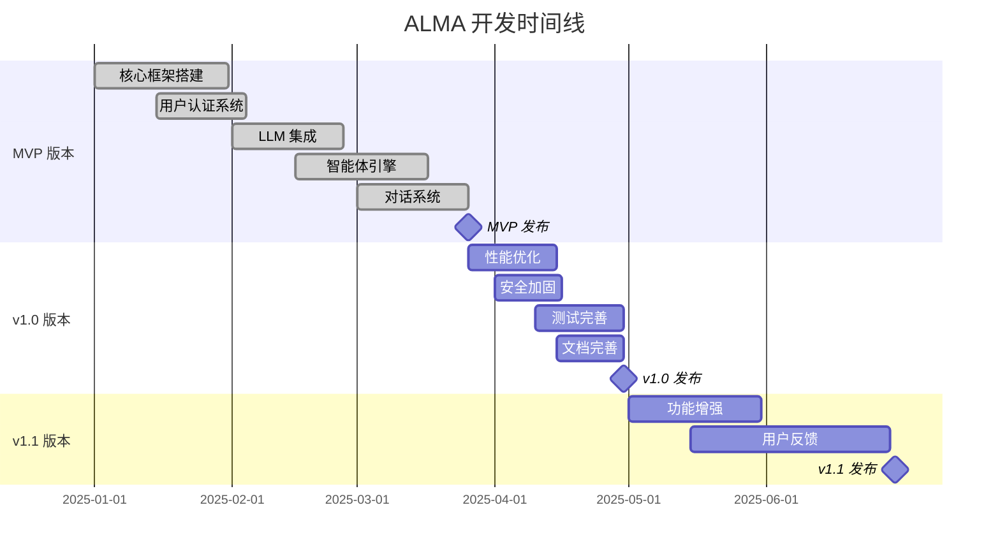

#### 6.1.2 发布计划

**MVP 版本 (v0.1)** - 2025年3月
- ✅ 基础功能完整可用
- ✅ 4个核心智能体
- ✅ Web 界面和 API
- ✅ Docker 部署

**v1.0 版本** - 2025年4月
- 🔄 性能和稳定性优化
- 🔄 安全性加固
- 🔄 完整的测试覆盖
- 🔄 详细的部署文档

**v1.1 版本** - 2025年6月
- ⏳ 用户反馈驱动的功能增强
- ⏳ 智能体能力扩展
- ⏳ 多语言支持
- ⏳ 移动端优化

### 6.2 团队需求

#### 6.2.1 团队结构

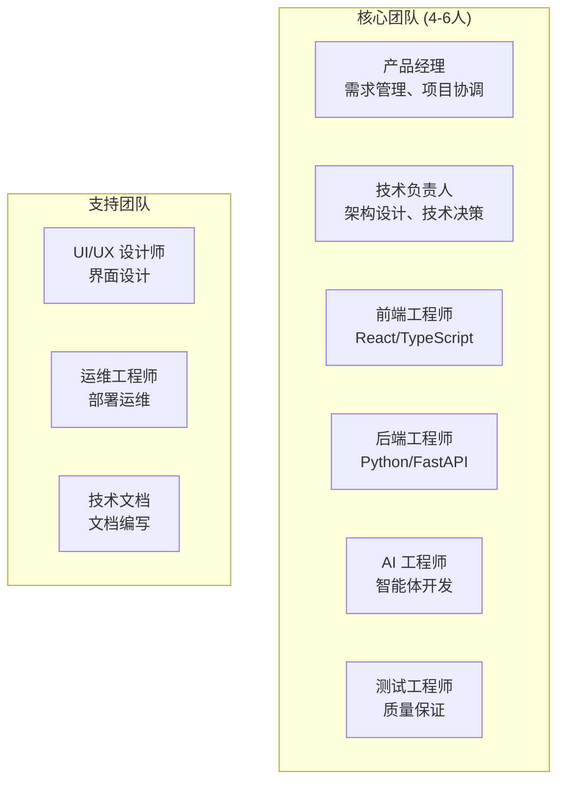

#### 6.2.2 技能要求

**必备技能**：
- **前端**：React, TypeScript, 现代前端工程化
- **后端**：Python, FastAPI, 数据库设计
- **AI**：LLM 应用开发, 智能体设计
- **全栈**：系统架构, API 设计, 容器化部署

**加分技能**：
- 多智能体系统经验
- WebSocket 实时通信
- 性能优化和监控
- DevOps 和 CI/CD

### 6.3 风险管理

#### 6.3.1 技术风险

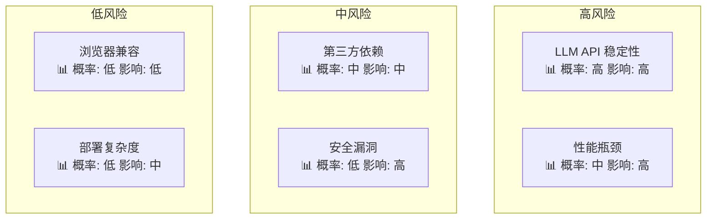

**风险应对策略**：

1. **LLM API 稳定性**
   - 多提供商接入
   - 服务降级机制
   - 本地模型备选方案

2. **性能瓶颈**
   - 早期性能测试
   - 缓存策略设计
   - 数据库优化

3. **安全风险**
   - 安全代码审查
   - 定期安全扫描
   - 渗透测试

#### 6.3.2 业务风险

**市场风险**：
- 用户需求变化
- 竞争产品出现
- 技术趋势转变

**应对措施**：
- 快速迭代开发
- 用户反馈收集
- 技术趋势跟踪

---

## 📊 7. 成功指标

### 7.1 技术指标

#### 7.1.1 性能指标

| 指标类别 | 具体指标 | 目标值 | 监控方式 |
|---------|---------|-------|---------|
| **响应性能** | API 平均响应时间 | < 2s | APM 监控 |
| | WebSocket 连接延迟 | < 100ms | 实时监控 |
| | 首屏加载时间 | < 3s | 浏览器监控 |
| **可用性** | 系统正常运行时间 | > 99.5% | 健康检查 |
| | 故障恢复时间 | < 5min | 告警系统 |
| **扩展性** | 并发用户数 | 100+ | 负载测试 |
| | 水平扩展能力 | 支持 | 架构设计 |

#### 7.1.2 质量指标

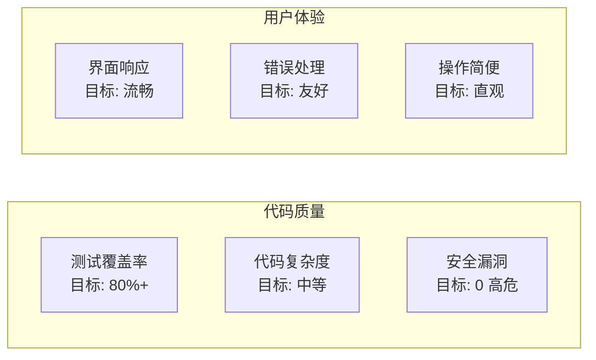

### 7.2 业务指标

#### 7.2.1 用户指标

**用户增长**：
- 月活跃用户 (MAU): 目标 500+
- 用户留存率: 30 天留存 > 40%
- 新用户转化: 注册到首次对话 > 80%

**用户行为**：
- 平均会话时长: > 10 分钟
- 日均消息数: 用户人均 20+ 条
- 功能使用率: 各智能体使用分布均衡

#### 7.2.2 产品指标

**功能效果**：
- 智能体响应准确率: > 90%
- 任务完成率: 复杂任务 > 80%
- 用户满意度: NPS > 50

**成本效益**：
- LLM API 成本: 控制在合理范围
- 服务器成本: 单用户成本 < $1/月
- 开发效率: 功能迭代周期 < 2 周

### 7.3 里程碑验收

#### 7.3.1 MVP 验收标准

**功能完整性**：
- [x] 用户可以注册、登录、配置 LLM
- [x] 4 个智能体可以正常协作
- [x] 对话界面流畅可用
- [x] Docker 一键部署成功

**质量标准**：
- [x] 核心功能测试通过
- [x] 性能达到基础要求
- [x] 安全基线满足要求
- [x] 部署文档完整

#### 7.3.2 v1.0 验收标准

**稳定性**：
- 7x24 小时运行无故障
- 100 并发用户压力测试通过
- 所有安全扫描通过

**完整性**：
- 功能测试覆盖率 100%
- 用户文档和开发文档完整
- 监控和告警系统就绪

---

## 📄 8. 附录

### 8.1 术语表

| 术语 | 英文 | 定义 |
|-----|------|------|
| **智能体** | Agent | 具有特定能力和职责的 AI 实体 |
| **编排智能体** | Orchestrator Agent | 负责任务分析和智能体调度的核心智能体 |
| **任务上下文** | Task Context | 智能体间传递的任务状态和信息 |
| **工具调用** | Tool Calling | 智能体使用外部工具执行特定功能 |
| **LLM** | Large Language Model | 大语言模型，如 GPT、Claude 等 |
| **多轮对话** | Multi-turn Conversation | 具有上下文连续性的对话交互 |
| **流式响应** | Streaming Response | 实时逐步返回响应内容 |
| **任务分解** | Task Decomposition | 将复杂任务拆分为可执行的子任务 |

### 8.2 参考资料

**技术文档**：
- [FastAPI 官方文档](https://fastapi.tiangolo.com/)
- [React 官方文档](https://react.dev/)
- [OpenAI API 文档](https://platform.openai.com/docs)
- [Docker 部署指南](https://docs.docker.com/)

**竞品分析**：
- AutoGPT: 全自动 AI 代理
- LangChain: LLM 应用开发框架
- Microsoft Semantic Kernel: AI 编排框架
- Zapier: 工作流自动化平台

**行业报告**：
- [AI Agent 技术发展报告](https://example.com)
- [多智能体系统研究综述](https://example.com)
- [企业 AI 应用现状调研](https://example.com)

### 8.3 变更记录

| 版本 | 日期 | 变更内容 | 负责人 |
|-----|------|---------|--------|
| v1.0 | 2025-06-24 | 初始版本，完整需求规格 | 产品团队 |
| | | | |
| | | | |

---

## 📞 联系方式

**项目团队**：
- 产品负责人：[姓名] <email@example.com>
- 技术负责人：[姓名] <email@example.com>
- 项目经理：[姓名] <email@example.com>

**文档维护**：
- 本文档由产品和技术团队共同维护
- 重大变更需经过团队评审
- 定期更新以反映最新需求

---

*本需求文档是 ALMA 项目的核心指导文件，所有开发活动应以此为准。如有疑问或建议，请及时与项目团队沟通。*
